# Adobe Premiere... continued 🎥📹💻
-->[Go here for first Premiere tutorial- the basics](https://github.com/art75/SJSU-art75/tree/master/tutorials/01_Premiere)

 ◇─◇──◇────◇────◇────◇────◇────◇─◇─◇
 

##### Included on this page:

1. [Aspect Ratio and Sequence](#-aspect-ratio-and-sequence)
2. [Targeting Tracks](#-targeting-tracks)
3. [Adding Still Images](#-adding-still-images)
4. [Picture in Picture](#-picture-in-picture)
5. [Replace a Clip](#-replace-a-clip)
6. [Trimming a Clip](#-trimming-a-clip)
7. [Rate Stretch Tool](#-rate-stretch-tool)
8. [Freeze Frames](#-freeze-frames-and-stills)
9. [Basic Audio Adjustments](#-audio-adjustments)
10. [Expanded Color Correction](#-expanded-color-correction)

 
 

# ▼△▼△▼ Aspect Ratio and Sequence

[Read and watch videos about resolution here](https://vimeo.com/blog/post/the-basics-of-image-resolution)

* When you drag a clip into the timeline, the new sequence in the timeline sets up settings to match that of the clip.
* If all of your clips are the same size and frame rate, then this is a good way to go.

* If your clips are different sizes and frame rates, and you have a specific outcome needed for your sequence, determine your aspect ratio and size by creating a sequence ahead of time.

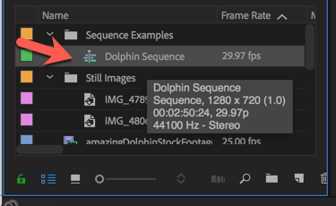

* You can check your sequence settings by hovering over your sequence in the Project window (note: sequence icon vs stills vs audio/video)

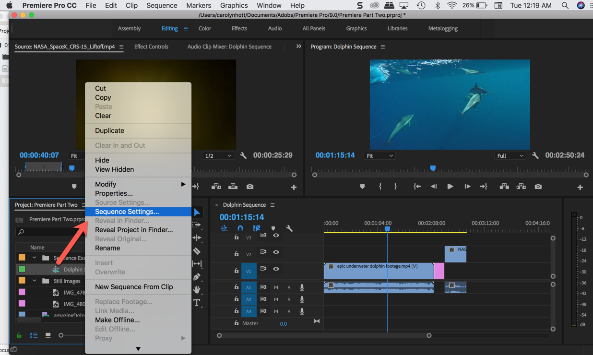

* You can also right click and navigate to **'sequence settings'**

* Here you can make adjustments to the frame rate and aspect ratio if needed.

 
 

# ▼△▼△▼ Targeting Tracks

- You can target tracks by pre-selecting V1 (video) or A1 (audio) before moving your clip to the timeline.

**Timeline Tips:**

Keyboard shortcuts for zooming in and out of ENTIRE Timeline: + or -

 
Keyboard shortcuts for expanding height of a track: Cmd/Ctrl + or -

 
 

# ▼△▼△▼ Adding Still Images

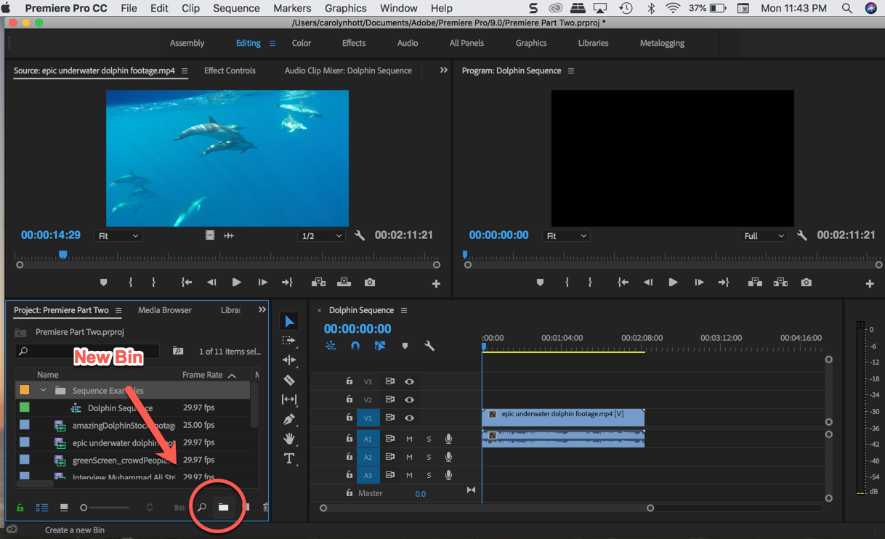

* Create a new Bin in your Project window for your still images.

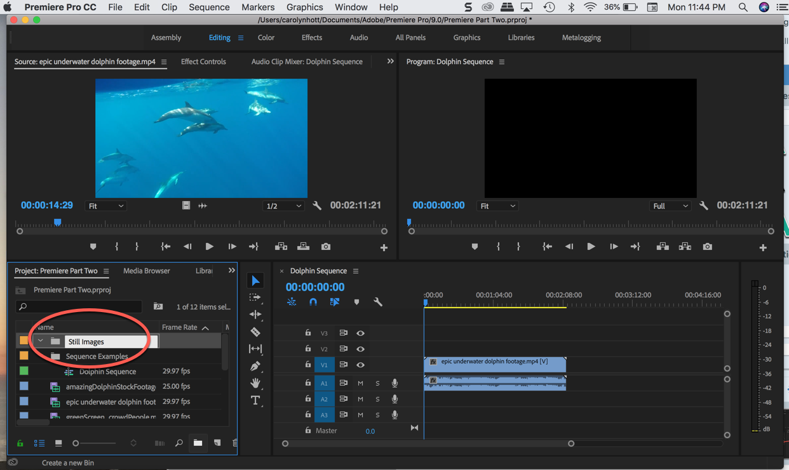

* Click open the bin and double click in the window to import your still images.
* Once imported, you can view your source images in the source monitor as you did with your video files.

* You can drag your still images from the source monitor to the timeline, as with your video files.
* To lengthen the amount of time that the still is in your video, drag one side or the other of the box on your timeline.

 
 

# ▼△▼△▼ Picture in Picture

* To overlay a clip or still image on a sequence, first select your media file in your Project Panel and mark in/out if needed in the Source Monitor.
* Then drag from the Source Monitor to the Program Monitor, and a grid of options will appear> Hover and let go on **Overlay**
* Once you let go, the clip should appear in the V2 row of your timeline.
* You can then move it to the exact location in the sequence you would like.

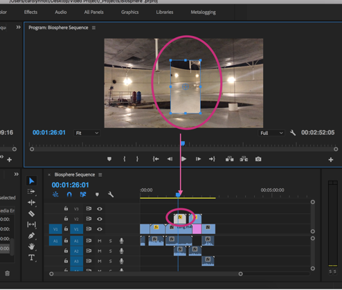

* To resize the clip that is overlaid, click on the clip in the Program Monitor and a wireframe and crosshairs will appear
* Drag the wireframe until the clip is the size you would like
* Move the image to the screen location you would like in your overall video

 
 

# ▼△▼△▼ Replace a Clip

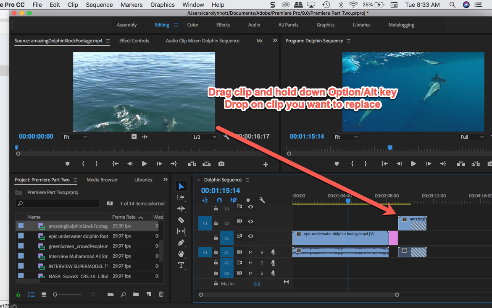

 * To replace one clip with another, drag your new clip from the Source Monitor while holding Option/Alt key

 

* If you want it to ripple = option delete
delete an area

 

 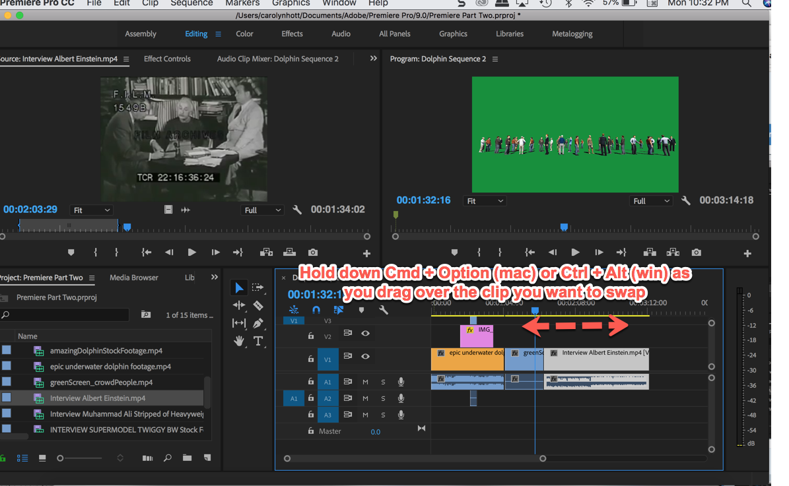

* You can use razor tool but marking in and outs is better ... use colon and apostrophe - this will only lift/extract the active tracks.

* Prepare the clip you would like to insert in the middle of a clip in your timeline in the Source Monitor (mark in/out if desired).

* Position your playhead in the timeline where you would like that clip to be inserted.

* Select the Source Monitor by clicking on it so it is highlighted, then press **,** (the comma key), and the clip will insert where the playhead is positioned.
 
 
 

# ▼△▼△▼ Trimming a Clip

When your clips in your timeline have rough in and out marks, you can do more precise editing in the timeline. many editors rough it in first and then come back and refine.

Use the **Ripple Edit Tool** or **B** key

**e** is the shortcut for extended edit - instead of dragging clip to cursor.

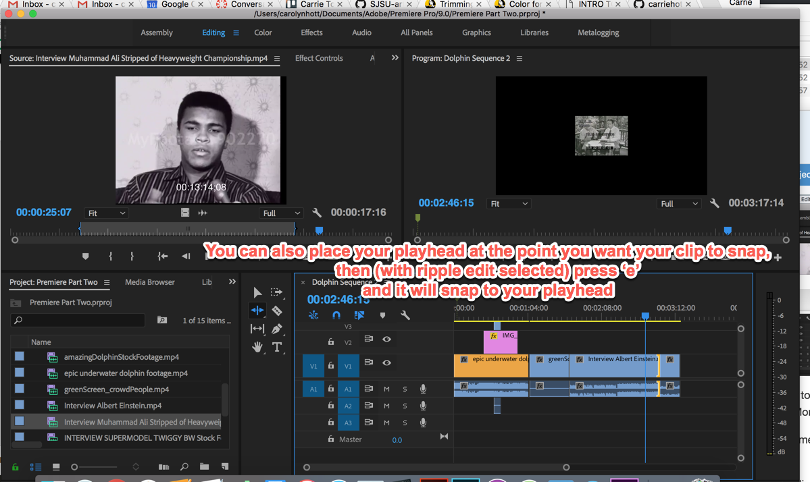

More options to try:  
* The rolling edit tool and rate stretch tool are hidden under ripple edit.
* Option and arrow will trim left or right once edge is selected
* If you want to edit just audio or video in synced clips, hold down Opt or Alt to just affect that track

 
 

# ▼△▼△▼ Rate Stretch Tool

* The Rate Stretch Tool is an easy way to create slow-motion or fast-motion effects by dragging out the length of your clip in your timeline
* With the tool selected, just drag the footage using your mouse on the timeline to change duration
* Another way to create slow/fast motion is to right click on the clip and select **speed/duration**. This will allow you to make numeric adjustments to the speed and duration (ie: 50% to slow it down to half-speed).

 
 

# ▼△▼△▼ Freeze Frames and Stills

 
 

# ▼△▼△▼ Audio Adjustments
-->[links to more tutorials here](https://github.com/art75/SJSU-art75/tree/master/tutorials/01_Premiere#-working-with-audio)

First! The difference between **gain** and **volume**. Both refer to loudness of audio.

**Gain** = the input level, or the first control in the microphone when recorded  
**Volume** = the output level, or the control after it has been processed (edited)

Gain generally refers to the input level or volume in **clips**. Volume generally refers to the output level or the volume in **sequence clips** or tracks. You can set gain or volume levels to make levels more consistent among tracks or clips, or to change the volume of a track or clip. Keep in mind, however, that if the level of an audio clip was set too low when it was digitized, increasing the gain or volume might simply amplify noise. For best results, follow the standard practice of recording or digitizing source audio at the optimum level; this practice allows you to concentrate on adjusting track levels.

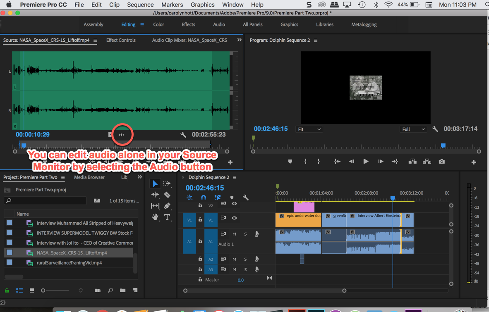

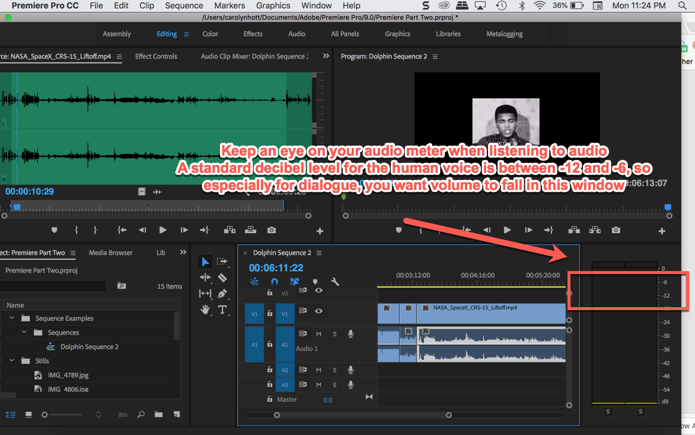

**To adjust gain**

First check and adjust gain in your source clips. make a baseline adjustment so that the dB level is between **-6 and -12**, then later adjust volume in your sequence.

* Also, to change audio configurations for source audio, right click in project window and go to modify -> audio channels. Here you can adjust Stereo and Mono.

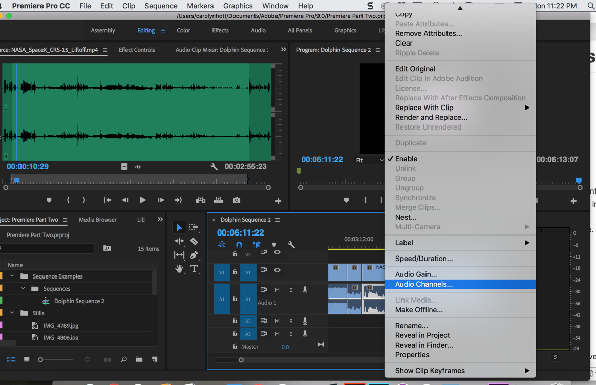

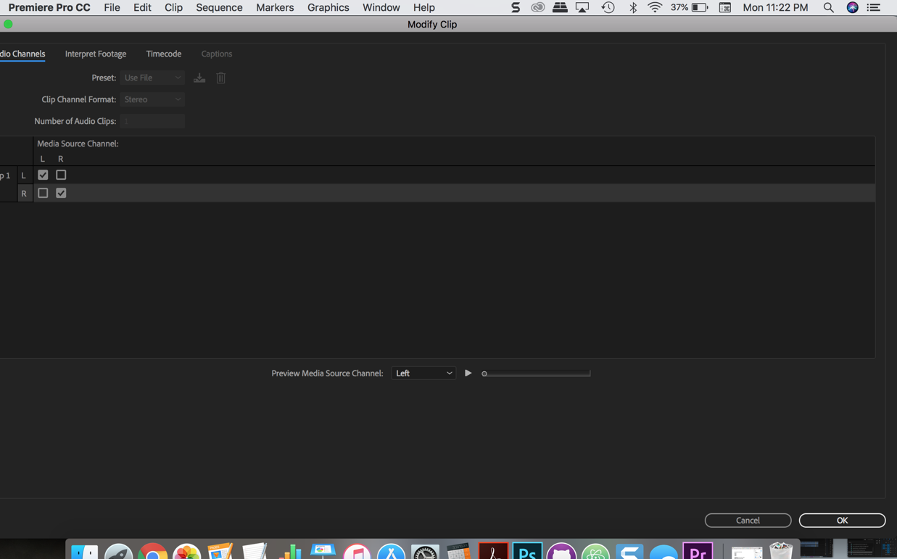

- The shortcut for raising lowering volume is the left and right brackets

- add keyframes in timeline, command or control click on volume level bar itself  
- bracket shortcut applies to keyframes
- delete keyframes by just hitting delete
- dissolves = shift cmmd D
- show default length for cross dissolves in project settings

 
 

# ▼△▼△▼ Expanded Color Correction

*See intro to color correction in [Premiere Tutorial 1](../01_Premiere)*

**Best Color Correction Workflow**: First, correct individual shots, and then move from shot to shot checking and adjusting consistency.

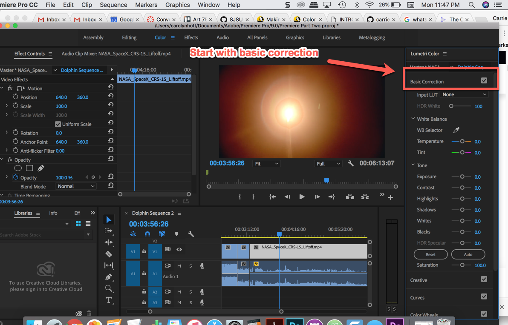

**++ in progress++**

**Basic tools**

- lumetri scopes: parade and waveform

- auto color, auto contrast, auto levels are all obsolete effects that can help

**lumetri color correction**
- hit auto at bottom

first do tone = exposure contrast
tone:
- whites/blacks = white/black point = adjust upper and lower limits
    - common to raise white point and lower black point to make it more contrasty
- highlights/shadows affect just them and not others

**To adjust white balance**
- use dropper on a white point, and adjust from there.
