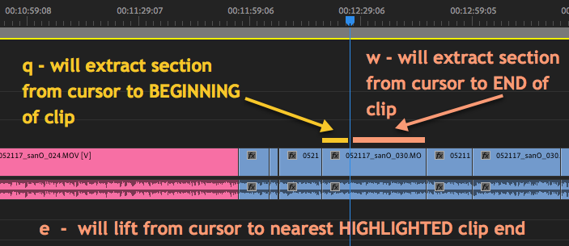
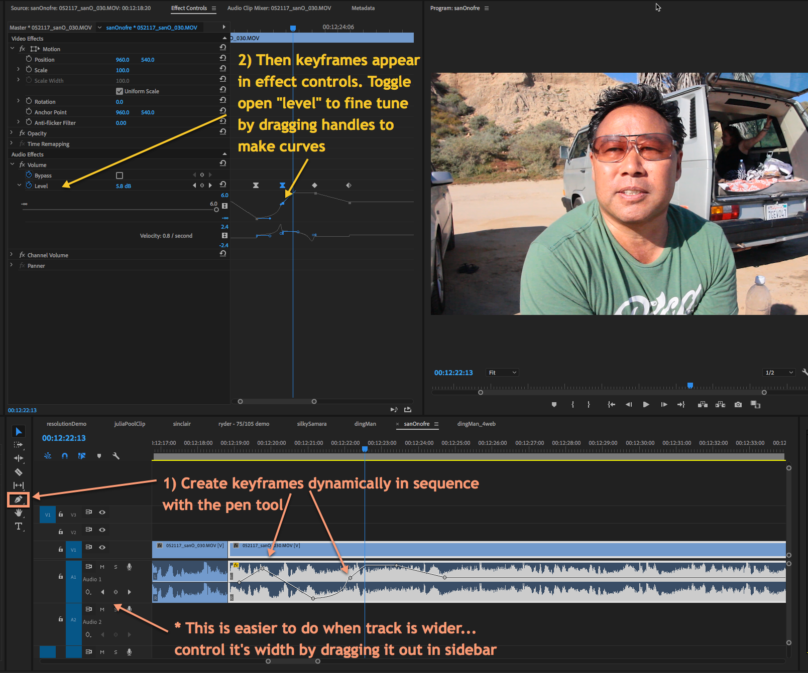

  # Adobe Premiere... Quick Tips🎥📹💻

 ◇─◇──◇────◇────◇────◇────◇────◇─◇─◇
 

##### Included on this page:

1. [Trimming clips in the timeline](#-trimming-clips-in-the-timeline)
2. [Keyframing with the Pen tool](#-keyframing-with-the-pen-tool) (adjusting audio volume in timeline)
3. [Links to more tutorials](#-links-to-more-tutorials)

---

# ▼△▼△▼ Trimming clips in the timeline

Using Lift or Extract to remove highlighted segments from In to Out:

 

Using Lift or Extract to remove segments from cursor to edge of clip:
keyboard shortcuts "q" and "w"

 

# ▼△▼△▼ Keyframing with the pen tool

Editing Audio Keyframes with the Pen Tool

 

Editing ANY PROPERTY’S KEYFRAMES with Pen Tool

 

# ▼△▼△▼ Links to more tutorials

* [Masking in Premiere](https://www.youtube.com/watch?v=Bi8Rc4hPl0A)
* [Green Screen](https://photofocus.com/2018/03/07/how-to-key-greenscreen-video-in-adobe-premiere-pro/)
