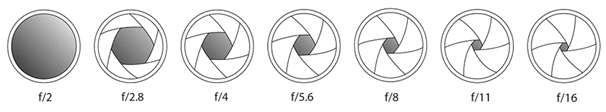
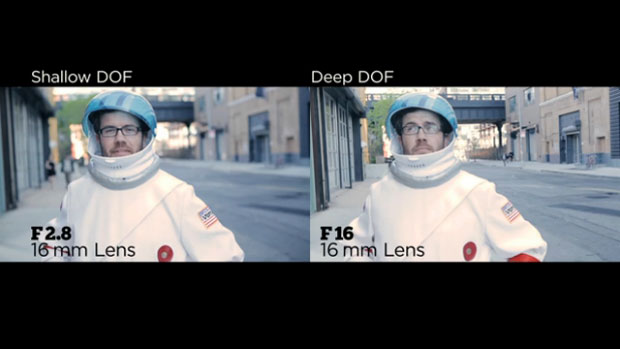
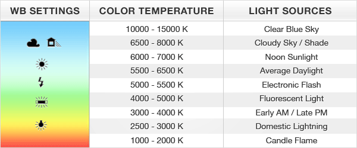
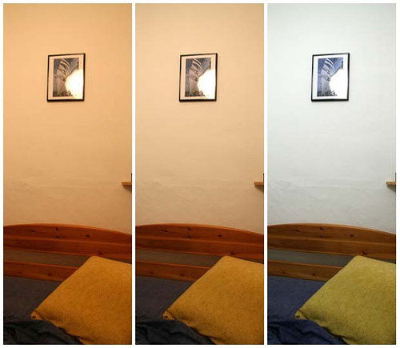

# ▼△▼ Shooting with DSLR cameras

 ◇─◇──◇────◇────◇────◇────◇────◇─◇─◇
 
 
 
##### Included on this page:

1. [Tips for getting good footage](#-tips-for-getting-good-footage)
2. [What is DSLR](#-what-is-dslr)
3. [ISO](#-iso)
4. [Aperture](#-aperture)
5. [Frame Rate and Shutter Speed](#-shutter-speed)
6. [White balance](#-white-balance)

# ▼△▼△▼ Tips for getting good footage

#### Camera set-up
* Make sure your battery is charged the night before
* Check the memory on your SD card before shooting, and format it (erase what is on it) if needed
* Check your lens and clean it with lens wipe or *very* soft fabric
* Set the video file settings (aka the movie record size / resolution) to your desired format
  * Standard HD is 1920x1080 at 24fps (for filmic look)

#### Camera record settings
* Make sure your shutter speed to be twice your frame rate
  * for 24fps shutter speed is 48 (same as 1/48), or round up to 50
* Set your aperture according to what depth of field you want in your shot
  * A wide aperture (a bigger hole = smaller number ie. 1.8) will give you smaller depth of field, where only some things are in focus
  * A narrow aperture (smaller hole = bigger number ie 16) will give you a wider depth of field, where many things are in focus
* ... then adjust your ISO and exposure to get a well-lit shot
  * ISOs over ~800 will start to look grainy
* Set your white balance using a white piece of paper

#### Shooting
* Keeping the camera steady, unless you have a reason for wanting it handheld
  - Use tripod or camera stabilizer
  - Be creative if you need to!
  - Keep handheld image steady by using a strap around neck or stabilizing arms against hips
* Increase the lighting whenever possible!
  * For less grainy shots, better footage
* Get things in focus
  - Zoom in to focus (DSLRs use digital zoom button)
  - Use the "Zeroing in" technique while adjusting the focus ring
  - Make sure you are in focus if shooting yourself
    - Focus on an object where you will be (ie. put a teddy bear on your chair)
    - Get someone else to focus for you

#### Get good audio!
***For more detailed instruction check out the [Recording Audio Tutorial](../02c_recordingAudio)***

* DSLRs have not-so-great built-in microphones, because they are not designed for video.
* Use the best microphone possible!
* Minimize background Noise
  - Hard to do outside
  - Inside: Turn off appliances, lights, air conditioning, shut windows
* Record at least 10 seconds of "room tone" before you shoot
* Keep microphone closest as you can to subject without microphone being in the shot
  - Watch out for "pops" from puffs of air if mic is too close to subject's mouth
* Make the audio as loud as possible without peaking
  - NO PEAKING - don't want sounds to go into the red
  - Voices ~ -6dB - -12dB
  - Background ~ -12dB
  - Careful about sounds from your hands on the mic
  - Always edit with headphones

# ▼△▼△▼ What is DSLR?

DSLR cameras were designed for still photography, but have been embraced by indie filmmakers. The main benefit to using a DSLR camera for video is the shallow depth of field because of their large image sensors, relative to video camcorders. Also, DSLRs can capture video at 24 frames-per-second (film standard), as opposed to the 29.97fps (TV/video standard). For these reasons, DSLRs can produce a very seductive 'film-like' image. The cons are that they aren't really designed for video. Some models don't have rotating viewfinders for shooting from different angles, and some controls are difficult to control while recording.

# ▼△▼△▼ ISO

* Adjusts how sensitive your camera is to light.
  * Higher ISOs are more sensitive to light - they will bring up exposure in low light situations. BUT high ISO's will make the image grainy. The rule of thumb is to make your ISO *as low as possible*. The goal is to find balance between exposure and grain.

*Here's a chart showing ISO brightness and noise (don't bother trying to press play in this image, it's a still from Vimeo ;-)*

 
 

# ▼△▼△▼ Aperture

* Controls amount of light reaching the image sensor. Think of it like a pupil dilating and constricting to let more/less light in. You measure aperture with the f-stop
  * Lower aperture settings let more light in. So an aperture of 1.8 is more open and lets more light in than an aperture of 8.0.
  * Lower aperture settings have a **shallow depth of field**, also known as shallow focus.  
  * Higher aperture settings create a larger depth of field, or deep focus.

 
 

# ▼△▼△▼ Frame Rate and Shutter Speed

* Your frame rate is how often your video is recording a frame to the file
* Shutter speed is how long the exposure time is *for each frame*
* Rule of thumb: double your frame rate to set your ideal shutter speed for film-like movement
  * So if you are shooting at 24fps, double that is 48. Sometimes there is no 1/48th shutter speed, so you round to 1/50th sec.
  * Shooting at 30fps ---> shutter speed of 1/60th sec
* Lower shutter speeds create more ***motion blur***, whereas higher shutter speeds (faster) will create sharper but stutter-y movement.
  * High shutter speeds are good for capturing fast-moving action like sports
* Lower shutter speeds will let more light in, higher shutter speeds will darken your image.
* If you want to shoot ***slow-motion***, you will want to raise your frame rate, not the shutter speed. This will result in more frames in your footage, that you can stretch out over time in Premiere (without it being blurry)

*Blur with low shutter speed*
 
 

# ▼△▼△▼ White balance

* White balance is basically telling your camera what color temperature you are shooting in
  * Different light sources have different temperatures, making more-blue or more-yellow light.
* You can use presets, or **set custom white-balance (preferred)**. Avoid using auto-white balance! It will cause hard-to-fix color-fades in your image.

 
 
