# Creating a GitHub Page - Free hosting on GitHub!
## Make your portfolio website

 ◇─◇──◇────◇────◇────◇────◇────◇─◇─◇
 

#### On this page:

1. [What is GitHub?](#-what-is-github)
2. [Create a GitHub Personal Page](#-creating-a-github-personal-page)
3. [Use GitHub Pages (for multiple repositories)](#-use-github-pages)
4. [Link to another page](#-linking-to-another-page)
5. [Embed video from Vimeo](#-embedding-video-from-vimeo)
6. [Using Developer Tools](#-using-developer-tools)
7. [Add divs and center images](#-add-divs-and-center-images)
8. [Responsive iframes: Making Video resize for mobile](#-responsive-iframes-making-video-resize-for-mobile)

 

---

 

# ▼△▼△▼ What is GitHub?

### What is Git & GitHub?

Git is a version control system that allows you to track changes to files over time, and allows you to revert to previous versions.

Github is a web hosting service for code-based projects. It uses Git, but is not Git itself. A lot of the code on GitHub is publicly available, so that developers (and you!) can easily check out what other people are doing, download their code, use it, and also post changes/improvements to the source.

Each project is contained in a "repository." Think of it as a independent folder for each project. For free Github accounts, all repositories are public. If you create a Github account with your SJSU email, you should AUTOMATICALLY be able to create unlimited private repositories.
 
 

### What is a GitHub page?

A GitHub page is a public webpage hosted for free through your GitHub account. You can have one personal GitHub page at: http:// yourGitHubUsername.github.io, and others for individual projects. We're going to set up the personal main page (it's a little easier to do), but if you want to, read about the differences and follow this [tutorial for creating GitHub Project Pages.](https://www.thinkful.com/learn/a-guide-to-using-github-pages/).

***Note:*** This is not a GitHub Page! What you are looking at right now is the README.md file for a repository folder. GitHub will automatically display a folder's README file, which uses [Markdown](https://www.markdowntutorial.com/), a simple language for styling text.
 
 

---
 

# ▼△▼△▼ Creating a GitHub Personal Page

 
 

Create a new repository

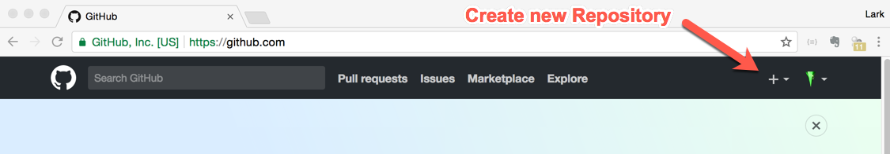
 
 

Name repository username.github.io, where ***'username' is YOUR github username.***

#### REPEAT: The repository needs to be named EXACTLY the same as your account username, followed by github.io ----> for example: username.github.io

Click 'Initialize with a README' and create. You can make it private if you want, people will still be able to see the website live.

 
 

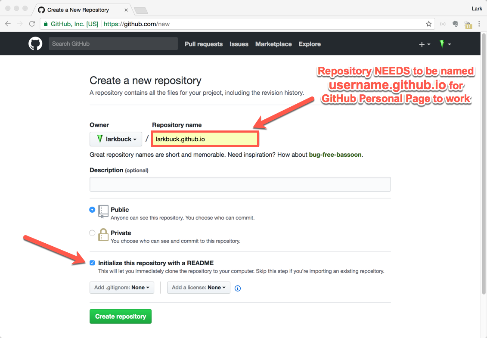
 
 

This is your repository. It automatically displays the README file, which is written in markdown. By default, it is just the name of your repo. Let's make changes to it.
 
 

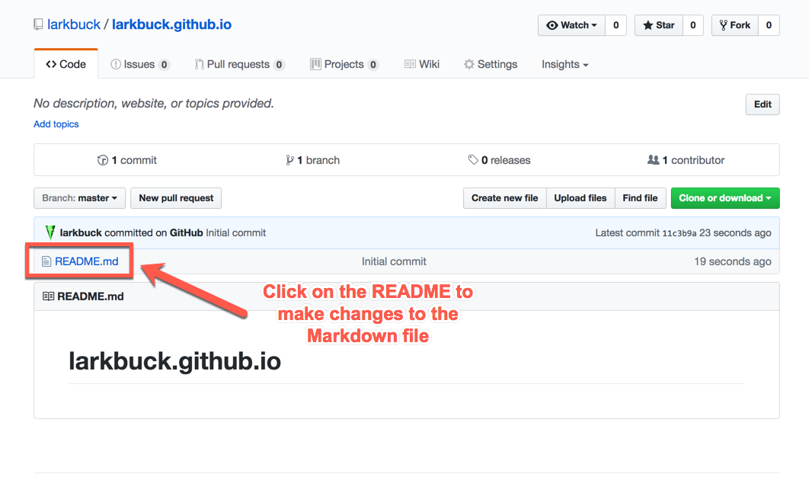
 
 

Click on the pencil to enter edit mode.
 
 

 
 

Now you can edit the README file in markdown. Check out [this tutorial](https://www.markdowntutorial.com/) to learn how to use markdown, or just customize the text I used (copy and paste from below).
 
 

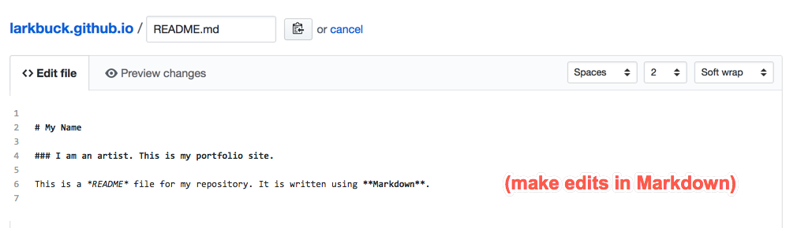
 
 

##### Code to copy:

    # My Name

    ### I am an artist. This is my portfolio site.

    This is a *README* file for my repository. It is written using **Markdown**.

 
 

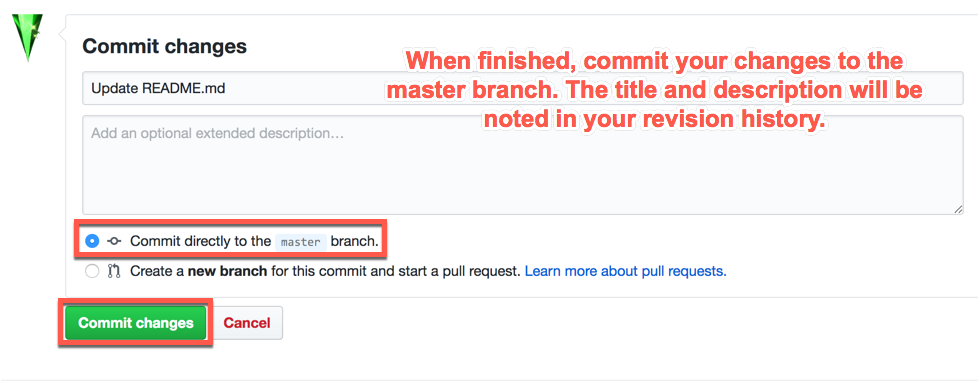
 
 

Yay! Now go back to your main branch.
 
 

 
 

With the new README, the GitHub repo looks a little more slick. But it still isn't a webpage. So now we are going to create an HTML file. The HTML will outline all the content for your site, including text, headers, links to images, video, etc.

Click 'create new file.'
 
 

 
 

Name this document index.html and copy and paste the code (below), to get you started.

The title tag (Your Name) is what appears in your browser tab. h1 is the header/title text for the page, and p is normal text (paragraph) ----> Edit them to make it yours.
 
 

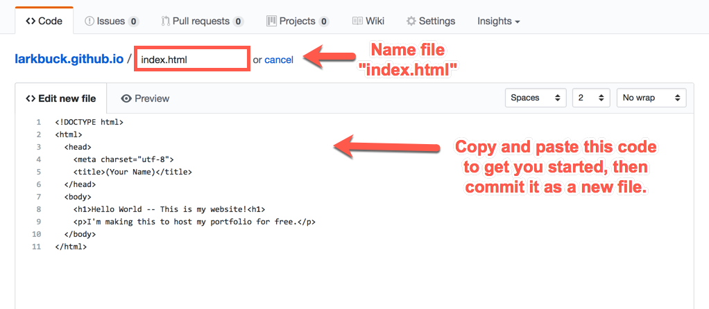
 
 

##### Code to copy:

    <!DOCTYPE html>
    <html>
      <head>
        <meta charset="utf-8">
        <title>(Your Name)</title>
      </head>
      <body>
        <h1>Hello World -- This is my website!</h1>
        
I'm making this to host my portfolio for free.

      </body>
    </html>

 
 

Now go to yourUserName.github.io — your website is live!! (it will take a minute to refresh)
 
 

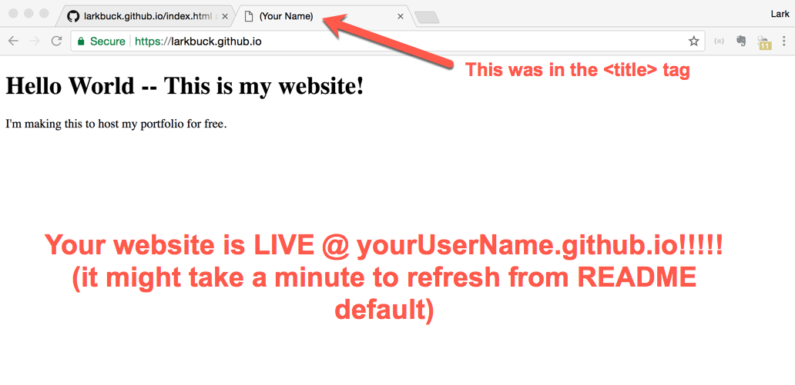
 
 

Woo hoo! But that is just the raw HTML. To change the way your website looks (color, font, spacing, etc), you will have to create another file, the CSS stylesheet.

Click on create new file.
 
 

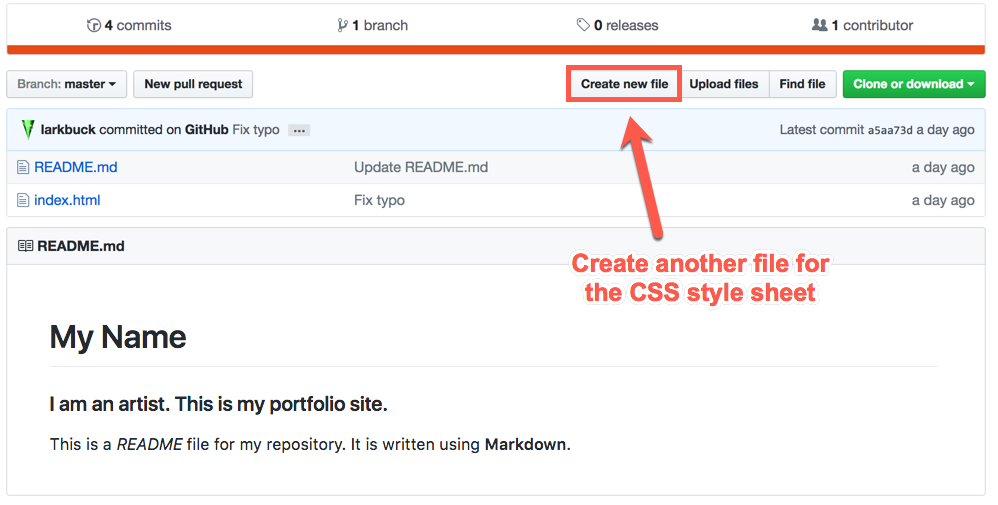
 
 

This time, name it 'main.css'. Just copy and paste the code I used (below), and commit to main branch.
 
 

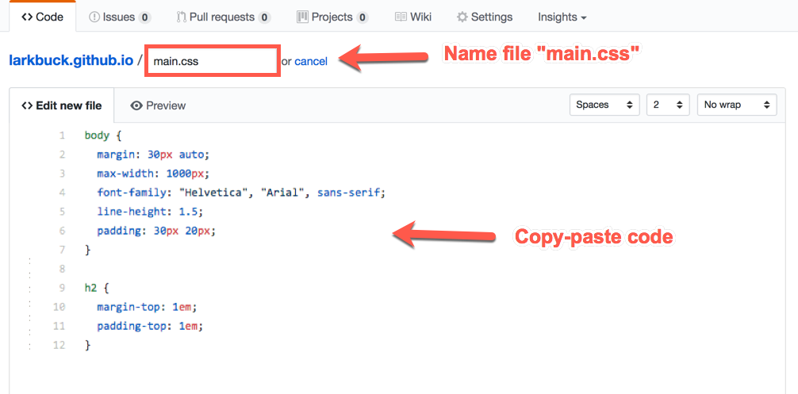
 
 

##### code to copy:

    body {
      margin: 30px auto;
      max-width: 1000px;
      font-family: "Helvetica", "Arial", sans-serif;
      line-height: 1.5;
      padding: 30px 20px;
    }

    h1 {
      padding: 20px 0px 10px 0px;
    }

 
 

But in order to see those changes, we have to link the CSS file to the HTML file. Click on the file name to open it.
 
 

 
 

Then click on the pencil to edit.
 
 

 
 

Now copy and paste this line:
 
 

    <link rel="stylesheet" type="text/css" href="main.css">

 
 

and place it inside the 'head' tag of your HTML. It tells the browser to look for a CSS stylesheet with the name of 'main.css' in the same folder as this HTML file.

Commit your changes. Change the description to say "link to CSS", or something that will help you remember what edit you made.
 
 

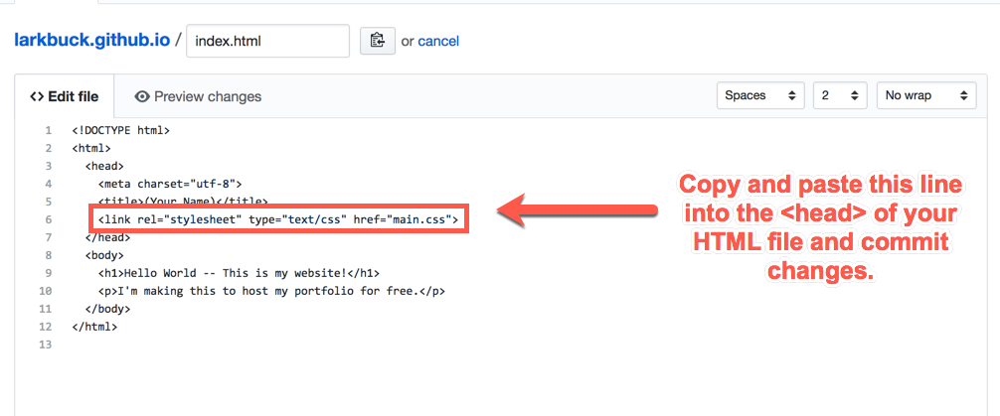
 
 

Now (after you wait a minute) you can refresh the GitHub page — it should look like this, with the font centered and changed to Helvetica, already looking more modern.
 
 

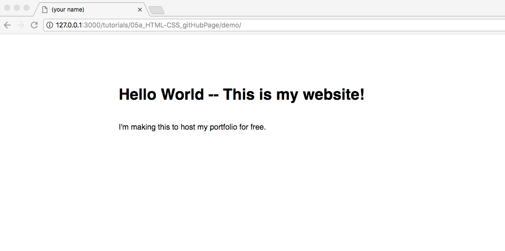
 
 

Play around as you (re)familiarize yourself with HTML and CSS.

For some quick styling, you can follow the tutorial: [Web Design in 4 Minutes](https://jgthms.com/web-design-in-4-minutes/), though you will need to add some images to your folder to get the full effect.

Mozilla Developer's Network (MDN) web docs site has [great tutorials](https://developer.mozilla.org/en-US/docs/Learn). W3Schools.com also has [CSS tutorials](https://www.w3schools.com/css/css_intro.asp), and CSS templates! I [downloaded a couple](/demos) if you want to check them out. They are in the demos folder of this tutorial.

[This tutorial](http://www.99lime.com/_bak/topics/you-only-need-10-tags/) is a good intro to the most-used HTML tags.

Note all the colors are in ***hexcodes***, a hashtag followed by six numbers or letters. You can use [this website](http://www.color-hex.com/) to get a hexcode for a color.

 
 

# ▼△▼△▼ Use GitHub Pages
If you have used GitHub before and previously created a website with a github.io address, then you won't be able to make a second github.io site. However, you can create what GitHub calls a "project" site and publish it using [GitHub pages](https://pages.github.com/).

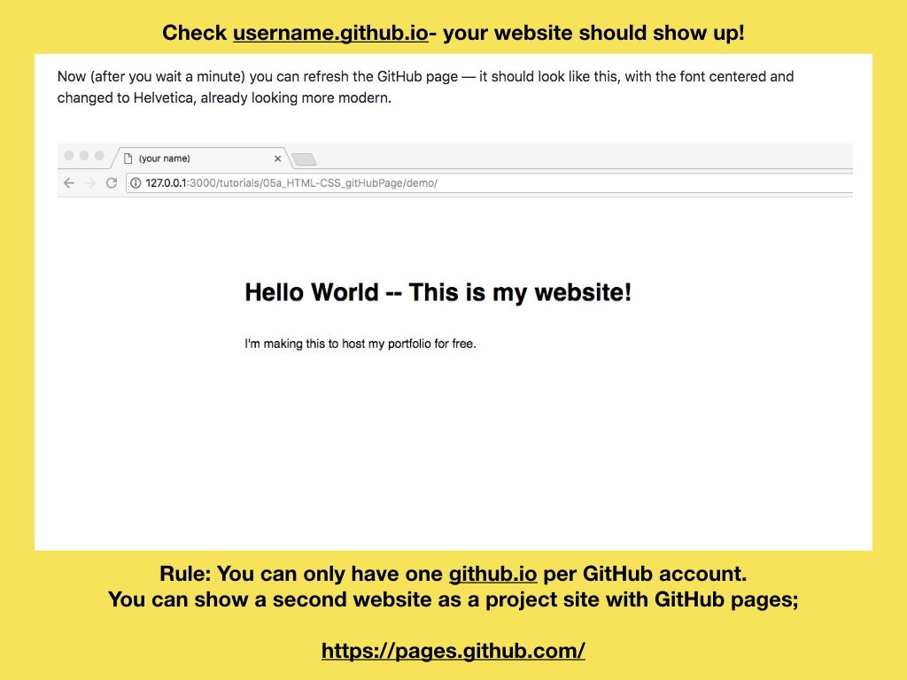

To begin making a project site, follow the same steps above and create a new repository, but leave off the github.io at the end. Remember! When naming your repository, do not use underscores only dashes (if necessary). Create the README.md, index.html, and main.css files.

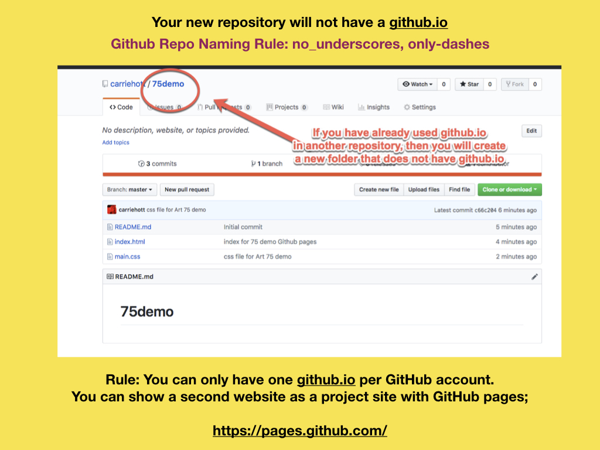

Then find the 'Settings' tab:

Scroll down to find the GitHub Pages section:

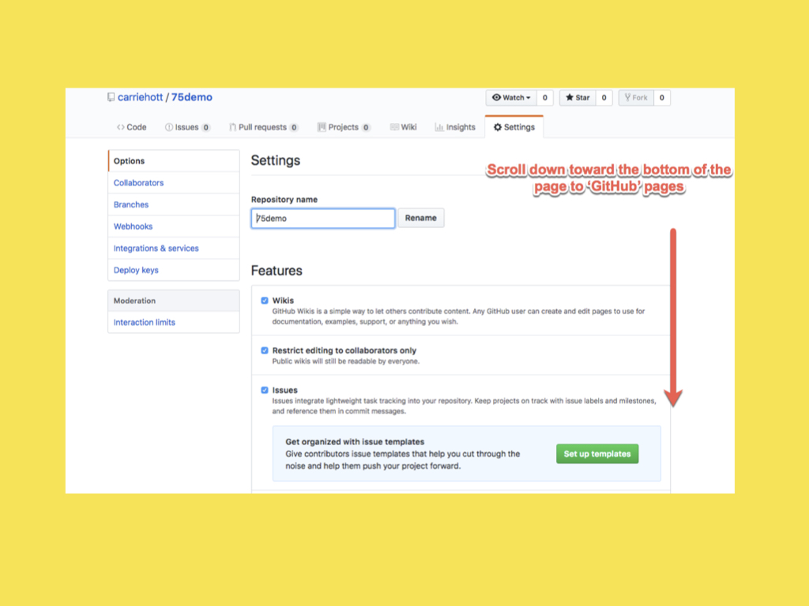

Select Master Branch and Save:

Click thru to the URL to see if your site is live. It may take a minute.

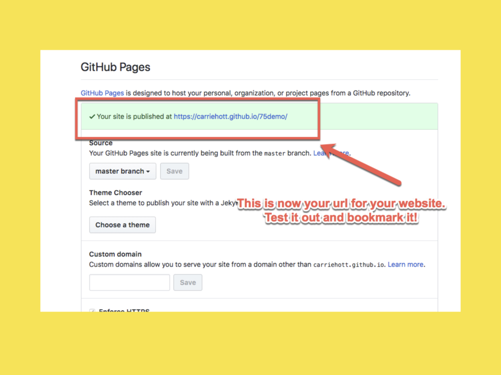

Save this URL, and use it for now. We can change it later.

Or, you may have been able to use your github.io url all along if you have not created one yet. However, if you plan to make a second site, GitHub pages is an option. 

---
 

# ▼△▼△▼ Linking to another page

 

To do this, we will create an HTML file for a second page, then we will link to it by using an anchor tag in the homepage (index.html) file.

First, create a new file.
 
 

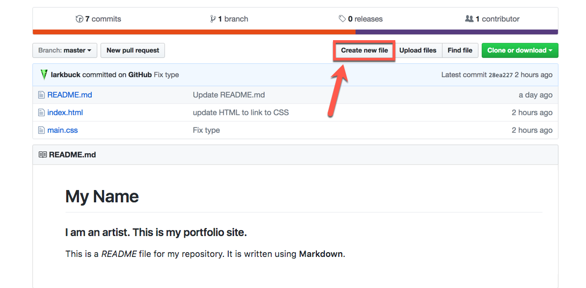
 
 

Let's make a separate page for your artist's statement. Name the file 'statement.html', and copy-paste the code below to start.
 
 

 
 

##### Code to copy:

(Notice the use of the 'em' and 'strong' tags — they make text italic or bold.)
 
 

    <!DOCTYPE html>
    <html>

    <head>
      <meta charset="utf-8">
      <title>(your name) | statement</title>
      <link rel="stylesheet" type="text/css" href="main.css">
    </head>

    <body>
      <h1>Artist Statement</h1>
      
Lorem ipsum dolor sit amet, <em>consectetur adipiscing elit</em>. Sed quis purus dolor. <strong>Maecenas sit amet</strong> turpis sodales, iaculis risus sed, venenatis massa. Nullam tempor vulputate porta. Sed ultricies turpis id justo condimentum, sit amet aliquam odio varius.
        Vivamus venenatis tincidunt velit, ut feugiat nisi sollicitudin eget. Vivamus libero elit, dapibus at egestas at, mollis pulvinar erat. Maecenas non purus arcu. Nullam vehicula feugiat arcu in faucibus. Nulla id blandit neque. Curabitur tempor tortor
        ex. Pellentesque et rutrum arcu, ut euismod urna. Vivamus sed ligula neque.

      
Ut suscipit nibh at magna tincidunt, et facilisis eros auctor. Integer cursus, eros sit amet ultricies eleifend, tortor massa tincidunt ante, quis ultricies mi nibh et enim. Nam quis risus elit. Morbi eget tortor molestie, rutrum nulla quis, mollis
        ligula. Sed ac blandit lacus. In porta id justo sed condimentum. Vivamus vitae ultricies neque, quis dapibus justo. Sed eget tempor libero. Quisque et libero ut odio interdum convallis quis et quam. Nulla eget est hendrerit, interdum felis quis, lobortis
        nibh. Fusce viverra leo eu massa pretium feugiat. Donec scelerisque justo sapien, at aliquet urna pellentesque ac. Aenean ut aliquet dolor. Morbi egestas ornare odio eu aliquet. Cras vel orci eros. Integer quis dui id augue convallis gravida ac vel
        sapien.
      

    </body>

    </html>

 

Cool. Now we need to go back into the index.html file and create a link to the new page.
 
 

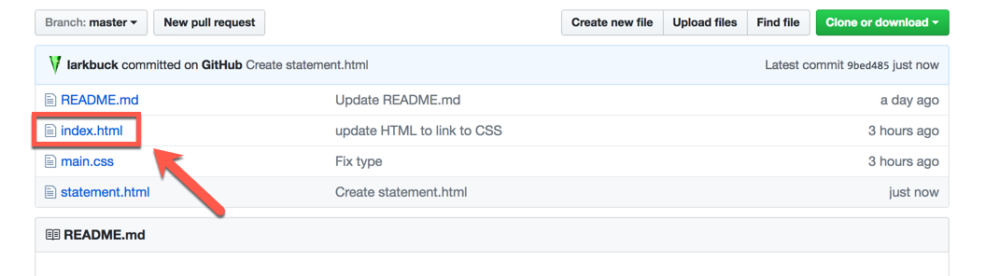
 
 

 
 

Once you are in edit mode, create a link using the anchor tag (code below).
 
 

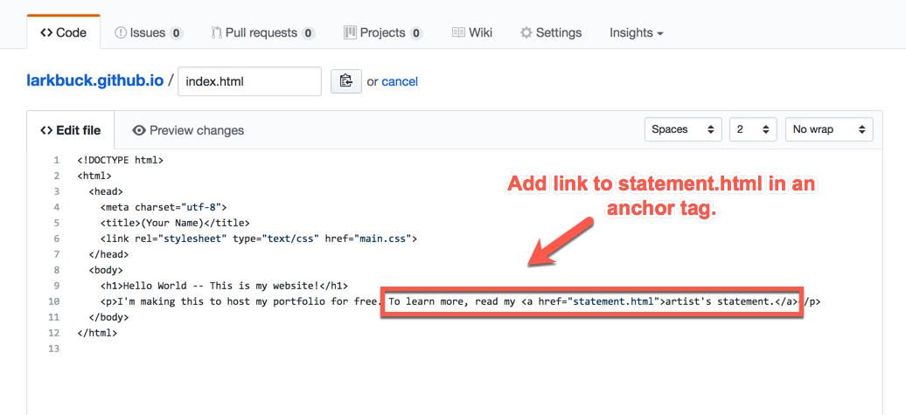
 
 

##### code to copy:

    
I'm making this to host my portfolio for free. To learn more, read my <a href="statement.html">artist's statement.</a>

 

Note the anchor tag — 'a' — creates hyperlinks in your HTML. It looks like this:
 

    <a href="statement.html">artist's statement</a>

 
 

The href indicates where the link is going  (href="www.link.com") and the visible text is ***between*** the two 'a' brackets.

Once you have committed your changes, your link should be live.
 
 

 
 

The default style for a link is underlined and dark blue/purple. Because it's hard to read on my background, I might change that to a lighter blue in my CSS, and set text-decoration to none.

You can make changes to all anchor tags (links) at once by using the CSS selector 'a' .  

I am also going to add 'text-align: center;' to the body tag in my CSS.
 
 

    body {
    text-align: center;
    }

    a {
    color: #69CBBB;
    text-decoration: none;
    }

 
 

It should now look like this:
 
 

 
 

When you click on the link......
 
 

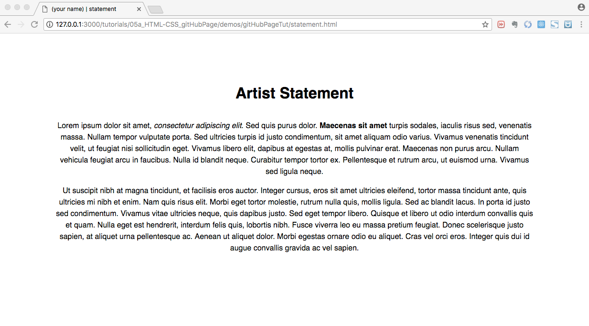
 
 

Note I changed the 'title' of the HTML page when we made the artist's statement. Convention is to name it 'website name | page title', using a pipe to separate the two.

 

---
 
 

# ▼△▼△▼ Embedding Video from Vimeo

 
 

To embed a video, you need the embed code. Vimeo will generate this for you. Go to your video's settings and select 'embed' from the sidebar.
 
 

 
 

Unfortunately you can't customize the embed unless you have a paid account. No worries though — the default is good enough. Click on the grey box that says 'embed code'.
 
 

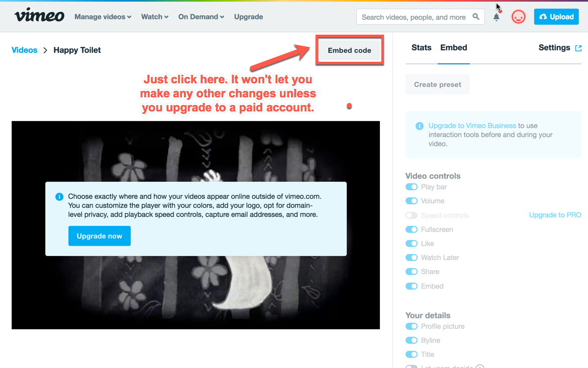
 
 

Copy the embed code. Note it is in an 'iframe' HTML tag. Iframe lets you include snippets from ***other websites*** in ***your page***. So we aren't hosting the video on your page, the iframe is just pointing to Vimeo's player.
 
 

 
 

Go back to edit your index.html and paste the embed code you got from Vimeo, somewhere in the body of your page.
 
 

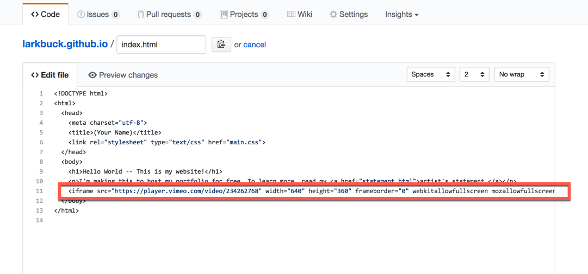
 
 

And there it is!

 
 

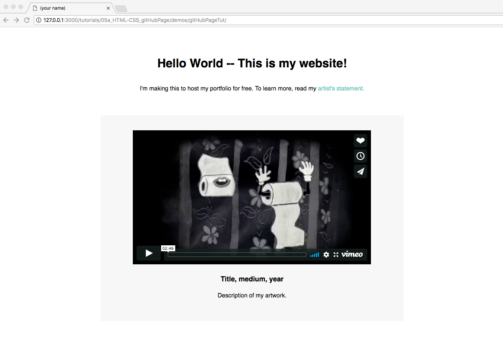

If you want to change the styling (border, etc), you can make changes to the 'iframe' element in your CSS.

 
 

# ▼△▼△▼ Using Developer Tools
Big Tip:
*** REMEMBER TO USE DEV TOOLS IN YOUR BROWSER. YOU CAN RIGHT CLICK --> INSPECT ANY ITEM ON THE PAGE TO LOOK AT THE HTML/CSS FOR THAT ELEMENT ***

 
 

# ▼△▼△▼ Add divs and center images

 

I added some CSS to create divs (containers) for each portfolio item, and center images inside them.  **You can download all this code in the [demos folder.](/demos)**

 

A big first step in learning HTML/CSS is to understand the difference between tags, classes, and IDs.
* [Simple explanation on HTML dog](http://www.htmldog.com/guides/css/intermediate/classid/)
* [More detailed overview on CSS-tricks.com](https://css-tricks.com/the-difference-between-id-and-class/)

If you get used to those concepts, you should be able to understand what most HTML/CSS templates are doing, and look things up as you need them.

There's more info about using templates and frameworks in the next tutorial.

 
 

## ▼ Center Images and add Divs for each portfolio item

#### HTML file:
portfolio items are placed in divs with class='portfolio-item'

    <!DOCTYPE html>
    <html>
      <head>
        <meta charset="utf-8">
        <title>(your name)</title>
        <link rel="stylesheet" type="text/css" href="main.css">
      </head>
      <body>
        <h1>Hello World -- This is my website!</h1>
        
I'm making this to host my portfolio for free. To learn more, read my <a href="statement.html">artist's statement.</a>

        

          <iframe src="https://player.vimeo.com/video/45489909" width="640" height="360" frameborder="0" webkitallowfullscreen mozallowfullscreen allowfullscreen></iframe>
          <h3>Title, medium, year</h3>
          
Description of my artwork.

        

        

          
          <h3><em>Fountaine</em>, Marcel Duchamp, 1917</h3>
          
You can also link to images using the 'img' tag.

        

      </body>
    </html>

 
 

##### CSS:

In CSS, comments are contained within /\* forward slashes with asterisks facing in \*/

    body {
      margin: 30px auto;
      max-width: 60%;
      font-family: "Helvetica", "Arial", sans-serif;
      line-height: 1.5;
      padding: 30px 20px;
      text-align: center;
    }

    h1 {
      padding: 20px 0px 10px 0px;
    }

    /* This changes color and removes default underline in links  */

    a {
    color: #69CBBB;
    text-decoration: none;
    }

    /* Centers images */

    img {
      display: block;
      margin: 0px auto;
      width: 100%;
    }

    /* When you put a period in front of a CSS declaration, it indicates you are
    creating a new class. We can apply this to div elements to create different
    portfolio entries */

    .portfolio-item {
      margin-top: 60px;
      padding: 40px;
      background-color: #f7f7f7;
    }

 
 

# ▼△▼△▼ Responsive iframes: Making Video resize for mobile

Right now, your video embeds will stay the same size, even if the window shrinks (or is displayed on mobile devices).

This code will allow videos to resize when the window is scaled, making this site mobile-friendly!

First, add the code below to your css. The embed-container class is for divs containing iframes with content from Vimeo.

    .embed-container {
      position: relative;
      padding-bottom: 56.25%;
      height: 0;
      overflow: hidden;
      max-width: 100%;
      height: auto;
    }

    .embed-container iframe,
    .embed-container object,
    .embed-container embed {
      position: absolute;
      top: 0;
      left: 0;
      width: 100%;
      height: 100%;
    }

 

Next, in your html file, place your iframe with the Vimeo embed inside a container with the class embed-container. Voila.

    

      <iframe src="https://player.vimeo.com/video/45489909" width="640" height="360" frameborder="0" webkitallowfullscreen mozallowfullscreen allowfullscreen></iframe>
    

 
 

---

#### Tutorial links:

* [Mozilla Developer's Network (MDN)](https://developer.mozilla.org/en-US/docs/Learn).  also
* [W3Schools.com CSS tutorials](https://www.w3schools.com/css/css_intro.asp)
* [Good intro to the most-used HTML tags](http://www.99lime.com/_bak/topics/you-only-need-10-tags/)
* [Web Design in 4 Minutes](https://jgthms.com/web-design-in-4-minutes/)
