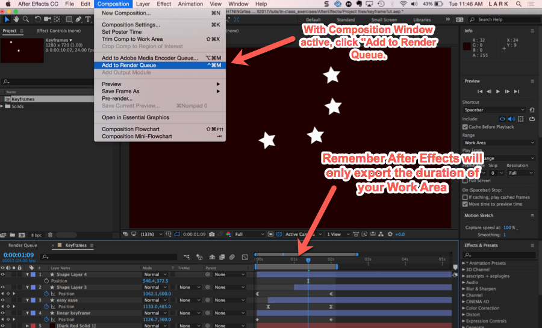
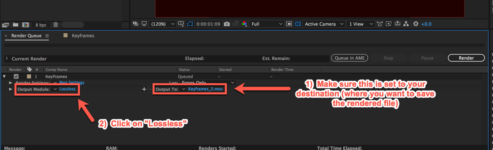
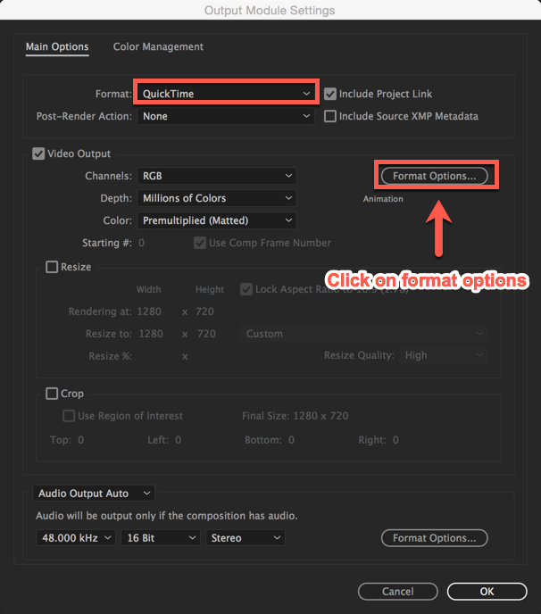
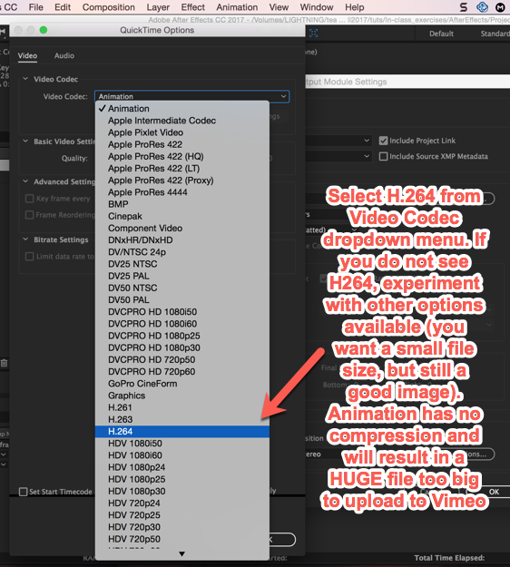

# Intro to After Effects

 ◇─◇──◇────◇────◇────◇────◇────◇─◇─◇
 

\*\* ***Note After Effects is a little tricky to get up-and-running. Navigating clips in the timeline is very different than Premiere. It is recommended that you watch an intro tutorial to familiarize yourself with the program before trying more advanced operations***

 

#### On this page:

1. [Keyboard Shortcuts](#-keyboard-shortcuts)
2. [Tutorials](#-tutorials)
3. [Exporting](#-exporting)
4. [Importing Photoshop and Illustrator Files](#-importing-photoshop-and-illustrator-files)

  

## ▼△▼△▼ Keyboard Shortcuts

|                                 |                                                                                            |
|---------------------------------|--------------------------------------------------------------------------------------------|
| ***Timeline Panel Shortcuts***                  |                                                                                            |
| I / O                           | Move cursor to in/out point of layer                                                       |
| home / end                      | Move cursor to beginning/end of composition                                                |
| cmmd right/left arrow           | Move cursor to left or right by one frame                                                  |
| Shift page up / shift page down | Move cursor to left or right by 10 frames                                                  |
| Enter timecode                  | You can also move cursor to specific frame by typing in the timecode in the left top field |
| [ / ]                           | Slides layer in/out to cursor                                                              |
| opt [ / opt ]                   | Slips layer in/out to cursor                                                               |
| J/ K                            | Previous/next keyframe                                                                     |
| B / N                           | Set work area start / end                                                                  |
| U                               | Reveals all animated properties of a layer                                                 |
| UU                              | Reveals all the properties you changed.                                                    |

|                    |                                                 |
|--------------------|-------------------------------------------------|
| ***Tool Shortcuts***     |                                                 |
| V                  | Selection tool (arrow)                          |
| H                  | Hand tool                                       |
| spacebar           | Temporarily activate Hand toll                  |
| Z                  | Zoom in tool                                    |
| Option (with zoom) | Zoom out (when zoom already activated)          |
| Y                  | Pan-Behind Tool                                 |
| Q                  | Activate and cycle through mask and shape tools |
| Cmmd  T            | Type Tool                                       |
| G                  | Pen Tool                                        |

 
 

# ▼△▼△▼ Tutorials

***Lynda Tuts***
* The Lynda tutorial ***[After Effects CC 2018: Essential Training](https://www.lynda.com/After-Effects-tutorials/After-Effects-CC-2018-Essential-Training-Basics/651227-2.html)*** is a quick and dirty introduction to the interface.
* Also on Lynda, ***[After Effects Apprentice](https://www.lynda.com/After-Effects-CS5-tutorials/apprentice-series-basic-animation/78544-2.html?srchtrk=index%3a9%0alinktypeid%3a2%0aq%3aafter+effects+apprentice%0apage%3a1%0as%3arelevance%0asa%3atrue%0aproducttypeid%3a2)*** is an excellent, comprehensive tutorial series on Lynda.

 
 

***Adobe Support Docs***
* [On masking and rotoscoping](https://helpx.adobe.com/after-effects/using/animating-shape-paths-masks.html)
* [Dynamic link between After Effects and Premiere](https://helpx.adobe.com/premiere-pro/using/dynamic-link.html)

 
 

***Youtube Tutorials:***
* [Keyframing movement](https://www.youtube.com/watch?v=u5YxwHkjMHc)
* [Different types of keyframes ](https://www.youtube.com/watch?v=t5rOILpSqcM) (Includes linear, roving, easy ease and hold keyframes)
* [Using the Rotobrush](https://www.youtube.com/watch?v=EoQLE57XzT0)
* [Using Keylight to work with green-screen footage](https://www.youtube.com/watch?v=5dbr105_gSs)
* [Isolating and changing a color in your scene](https://www.youtube.com/watch?v=PtVo6XwA13A)
* [Animating a mask in an adjustment layer](https://www.youtube.com/watch?v=StCBpTIwOFE) (Decent tutorial but I recommend feathering the mask a little more)
 
 

 
 

# ▼△▼△▼ EXPORTING

Step-by-step tutorial on exporting.

*Some systems won't have the H264 Codec listed. In this case, export as an mp4.*

 
 

# ▼△▼△▼ Importing Photoshop and Illustrator Files

**To retain layers**
  * Make sure you select "Composition - Retain Layer Sizes" in import dialogue. This will preserve Photoshop/Illustrator layers. If default "Footage" is selected, you will get one flat image

 
