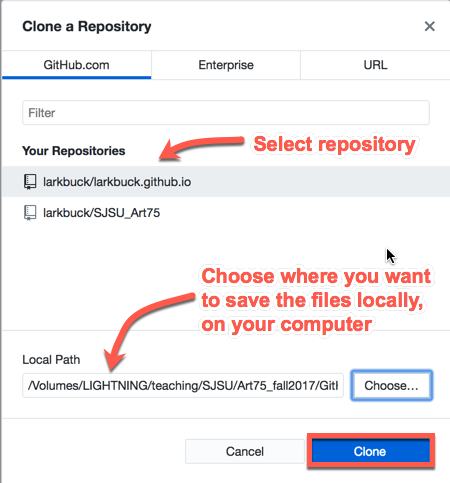
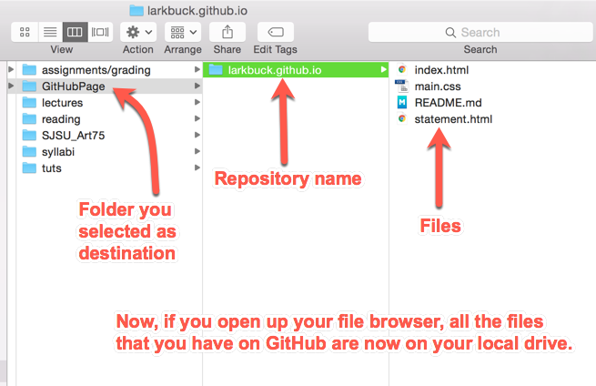
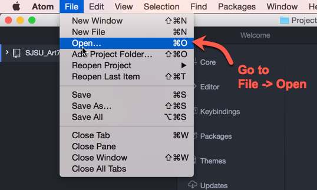
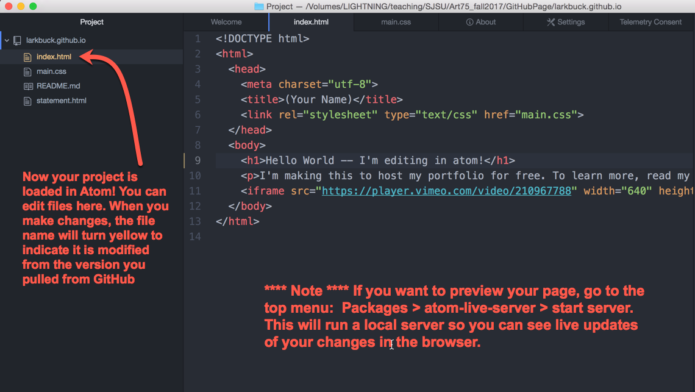
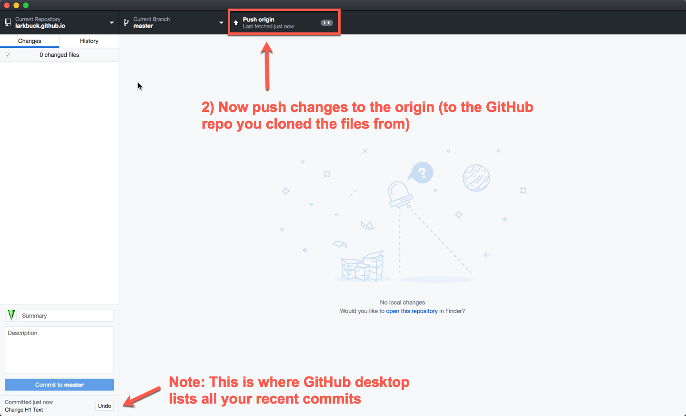

#  Using GitHub Desktop and Atom

 ◇─◇──◇────◇────◇────◇────◇────◇─◇─◇
 

#### On this page:

1. [Installing Atom and GitHub Desktop](#-installing-atom-and-github-desktop)
2. [Linking a GitHub Repository to your local hard drive](#-linking-a-github-repository-to-your-local-hard-drive)
2. [Editing in Atom and pushing to GitHub using Desktop](#-editing-locally-in-atom-and-pushing-to-github-using-github-desktop)
3. [More Tutorials](#-more-tutorials)

 
1) Tutorial for setting up GitHub & Atom. This will allow you to edit your repository *locally*, then push it to the remote (online) repository on GitHub.

2) Links to more tutorials to branching and collaborating with others using GitHub Desktop.

---
 

# ▼△▼△▼ Installing Atom and GitHub Desktop

#### 1. [Install GitHub Desktop](https://desktop.github.com/)

After [installing](https://desktop.github.com/) the app, you will have to log into your GitHub account in the GitHub Desktop App --> [tutorial here](https://help.github.com/desktop/guides/getting-started-with-github-desktop/authenticating-to-github/)
 
 

#### 2. [Install Atom](https://atom.io/)

Atom is a text editor: a program where you edit your code.

Q: *? Do I need to use Atom? Can I use another text editor?*

A: Absolutely! Atom does have some nifty features for integrating with GitHub (so it might be worth it to try it out), but ultimately you should use the editor you like best, ie. Sublime Text, Brackets, etc.

Once you install Atom, you might want to modify it by adding "packages", add-ons that will make Atom more powerful. Install atom-live-server, Atom-beautify, and Pigments.

 
 

# ▼△▼△▼ Linking a GitHub Repository to your local hard drive

Okay, now let's get into how you *really should be using* GitHub.

You shouldn't actually edit your code on the GitHub website (like we did in the last tutorial)!

Use GitHub Desktop to download (clone) your repository to your local drive (your computer). Then use a text editor (ie. Atom) to modify your code locally. THEN sync it back up to GitHub using GitHub Desktop.

Once you install Atom and GitHub Desktop, follow these steps to "clone" your repository from the GitHub website and save it to a folder on your local hard drive.

#### In GitHub Desktop:

#### ONCE YOU SET THE LOCAL FOLDER FOR YOUR REPOSITORY, DO NOT MOVE OR RENAME IT. If you do, GitHub Desktop will lose its location and things *get weird*.

***Choose this location wisely.***

 
 
# ▼△▼△▼ Editing in Atom and pushing to GitHub using GitHub Desktop

Once you make changes to your repository, the changes will appear in GitHub Desktop and you can "commit" and "push" to sync it up to GitHub (the website).

#### In Atom...

#### Note: You must type something in the "Summary" field for the commit (bottom left) before you can commit.

#### Also: You must commit before you can push.

 
#### Back on the GitHub Website....

___

# ▼△▼△▼ More Tutorials

#### Branching and collaborating with others using GitHub Desktop.

* [GitHub Desktop Tutorials (from GitHub)](https://services.github.com/on-demand/github-desktop/)
  * Specifically, look at how to [create local branches](https://services.github.com/on-demand/github-desktop/create-branches-github-desktop) of your repository, and make a [pull request](https://services.github.com/on-demand/github-desktop/pull-request-github-desktop)
* [Another tutorial](https://programminghistorian.org/lessons/getting-started-with-github-desktop) for collaborating with GitHub desktop
