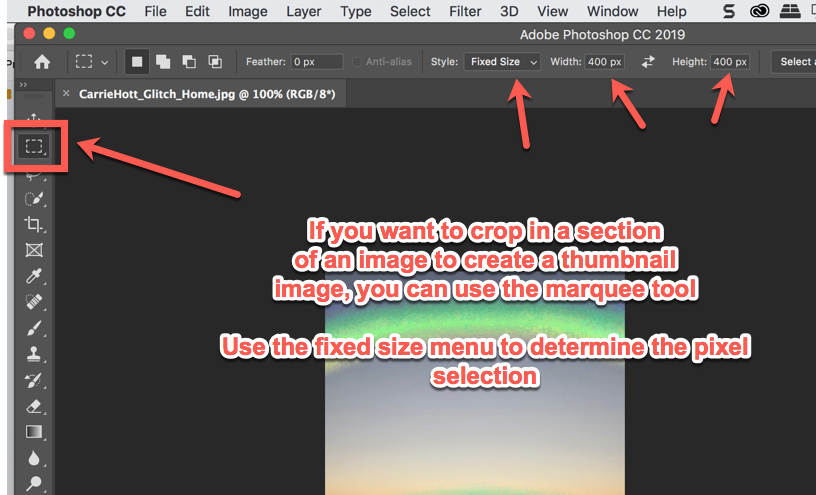
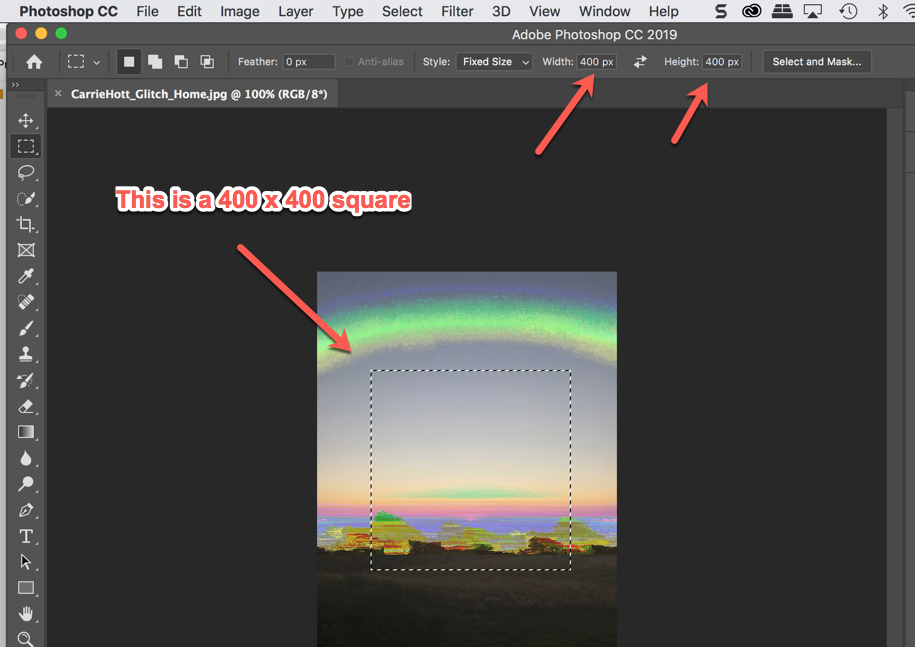

# Resizing and embedding images
 ◇─◇──◇────◇────◇────◇────◇────◇─◇─◇
 

#### **On this page:**
1. [Resizing Images](#resizing-images)
2. [Using the HTML Image Tag](#html-image-tag)

# Resizing Images
**Why is it important to resize your images for the web?** When your images are sized to match the same dimensions and resolution as displayed on your website, they load faster. Computer screens generally have a max resolution of 72 dpi. If your image is larger, then the computer loading your site has to resize your images before displaying them. When you size your images correctly, the computer showing your website doesn't have to adjust the size from the original file size in your website folder to the display size on the screen, so they load faster.

After you resize, you can further compress jpgs and pngs using an online compresser like [tinyjpg.com](https://tinyjpg.com/).

### **Resizing for web:**

### **Creating Thumbnails:**

 
 

# HTML Image Tag

### **The image tag**

The img tag —  — is pretty straightforward! Unlike other HTML tags, it does not need a closing tag at the end.

    

 
* [W3 schools documentation on the image tag](https://www.w3schools.com/tags/tag_img.asp)

 

### **HTML width and code in the image tag:**

All of your images will load at the size you determined in Photoshop UNLESS you write in a specific width and height in the image tag in your HTML document. This is only necessary when you need the image to load at a specific size that is different from the original file size. Example below:

