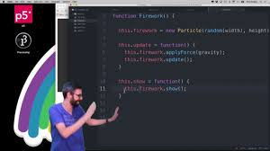
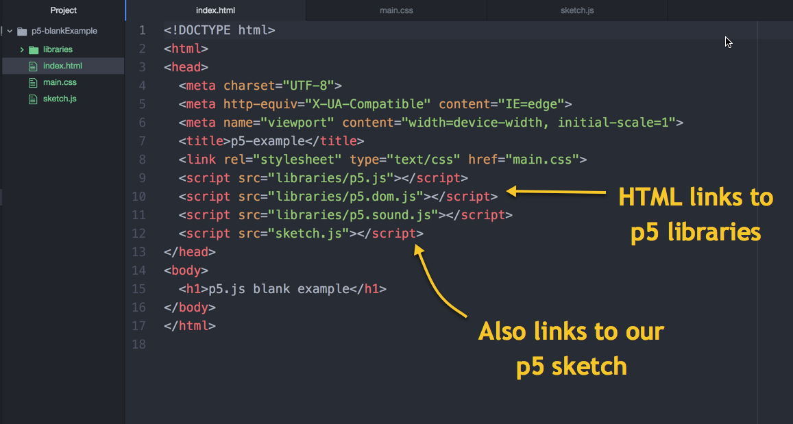
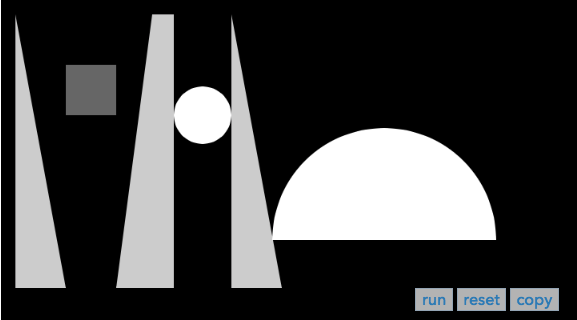
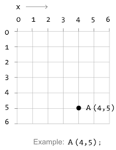
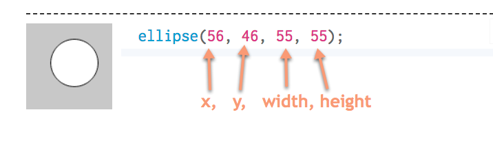

# Intro to Programming with p5.js

 ◇─◇──◇────◇────◇────◇────◇────◇─◇─◇
 

#### On this page:

1. [Resources](#-resources)
2. [Getting Started](#-getting-started)
3. [Code Basics](#-code-basics)
4. [Structure of p5](#-structure-of-p5)
5. [Drawing Shapes](#-drawing-shapes)
6. [Color](#-color)
7. [Variables](#-variables)
8. [In-class exercise 4](#-in-class-exercise-4)

**NOTE: This is not intended as a stand-alone tutorial. It is supplemental material for following along in class. For those of you who missed class, do follow along with the understanding that not everything is spelled out. Running the code and making changes to it is highly recommended.**

---
 

# ▼△▼△▼ Resources

ALWAYS refer to the p5 documentation online at p5js.org

* ***[p5 reference docs](https://p5js.org/reference/)***
* ***[p5 examples](https://p5js.org/examples/)***

 

 

**Videos:** Dan Schiffman's [Coding Train YouTube channel](https://www.youtube.com/channel/UCvjgXvBlbQiydffZU7m1_aw) is GREAT, and hilarious, and so GREAT.

⬇⬇⬇⬇⬇⬇⬇⬇⬇⬇⬇⬇⬇⬇⬇⬇⬇⬇⬇⬇⬇⬇⬇⬇⬇⬇⬇⬇⬇⬇⬇⬇⬇⬇⬇⬇⬇⬇⬇⬇
#### ***HIGHLY RECOMMEND the Coding Train playlist [Foundations of Programming in JavaScript: p5](https://www.youtube.com/playlist?list=PLRqwX-V7Uu6Zy51Q-x9tMWIv9cueOFTFA)***
⬆⬆⬆⬆⬆⬆⬆⬆⬆⬆⬆⬆⬆⬆⬆⬆⬆⬆⬆⬆⬆⬆⬆⬆⬆⬆⬆⬆⬆⬆⬆⬆⬆⬆⬆⬆⬆⬆⬆⬆

 

[Allison Parrish's tutorials](https://creative-coding.decontextualize.com/) are also excellent, and one of the sources used to compile these tutorials (thanks Allison!)

**Books:**

* [*Getting Started with p5.js*](https://p5js.org/books/)
* [*Learning Processing*](http://learningprocessing.com/)
  - This is Dan Schiffman's book on Processing (predecessor to p5 - in Java not Javascript)

 

# ▼△▼△▼ Getting Started

1. Download and unzip the [p5-blankExample folder](blankExamples/p5-blankExample.zip) from GitHub, in the *blankExamples folder* of this tutorial.

2. Copy it into your GitHub page local repository (the folder on your computer linked to the GitHub repo). Rename the folder "in-class_exercise_1"

3. Open it in Atom. Start a server by with the package we installed: Packages > atom-live-server > start server.

4. This will launch a browser page — if you add '/in-class_exercise_1' (or whatever you name the folder) to the end of the URL, it will display the contents of that directory: your p5 sketch live.

5. It will just look like a black box for now...

---> *IF YOU ARE HAVING TROUBLE WITH ATOM-LIVE-SERVER, YOU WILL NEED TO CREATE A LOCAL SERVER USING PYTHON OR NODE*

* To do this, follow [this tutorial](https://github.com/processing/p5.js/wiki/Local-server).

* If on a mac, you can use the program 'terminal' to make these installations using the command line. If a windows user, you will have to [install git bash](https://gitforwindows.org/) to get access to the command line prompt.  

 

#### Folder setup

You should have a folder that has the familiar index.html and main.css files, along with a libraries folder and sketch.js file...

* These libraries ARE p5.js ---> P5 is basically a bunch of code that runs on top of JavaScript. We link to it from our HTML <head> to access all the p5 magic.  
* sketch.js is the JavaScript file where you write your p5 sketch. We also link to this in the HTML <head>.

 

*Review:* Do you know how to navigate folders using code? What does "../" do?

 

# ▼△▼△▼ Code Basics

#### Code blocks

    {
      a block of code
    }

    {
      a block of code
      {
        a block of code inside a block
      }
    }

 
Note the indentation: keeping all your lines properly indented will make your code more readable. To auto format using the atom-beautify plugin we installed, use the shortcut 'shift cmmd b'.

 

#### Case sensitive

Javascript is case-sensitive — hello is different than Hello.

The convention is to use camelCase - squish words together and capitalize first letter of every new word.

Start variable, function and method names with lowercase letters. Class names with a capitalized letter,
(we'll get into what these mean later).

 

#### Comments

Single-line comments start with // and are terminated by the end of the line:

    // single-line comment

Multiline comments are delimited by /\* and \*/:

    /* This is
       a multiline
       comment.
    */

 * Shortcut to comment out a line or block of code is 'cmmd /' or 'ctrl /'

 

#### Note on debugging

* ***DEBUGGING IS THE ART OF ISOLATING POTENTIAL PROBLEMS***
* It can be very frustrating, but also so satisfying when you figure it out
* Having people to work with can really help if you get stuck.

 

---> ***USE THE CONSOLE***

The console is your debugger buddy! Use it often to check that your code is working, or to try to figure out why it is not.

 

    console.log("hello world! I am the console")

Try adding the code above to your p5 setup() function. Open up developer tools in your browser (right click > inspect), and see what appears in the console.

 

***NOTE on console.log:***  You can log strings (words in quotation marks), or *the value* of a variable by using its name, with no quotation marks.

    console.log("text string")
    console.log(variableName)

 
 

# ▼△▼△▼ Structure of p5

**setup( ) and draw( ) are two functions that are built into p5.**

* Code within the setup() function block runs JUST ONCE AT SETUP.

* Code within the draw() function block loops over and over.

* You can only have one setup() and draw() function in your sketch.

 

To see this in action, paste this into your sketch.js (erase what is there first).

    // declare variables at top

    function setup() {
      // runs once
      console.log("in setup function")
    }

    function draw() {
      // loops over and over
      console.log("in draw function")
    }

    // write functions here

See what happens in the console?
 

# ▼△▼△▼ Drawing Shapes

See [object primitives example](https://p5js.org/examples/form-shape-primitives.html) in p5 docs  ⤵

 
***Note:*** The x, y graph coordinates start at the top left of your canvas.

 

* To draw shapes to the screen, you call a function specific to that shape, and pass in a few parameters to set the x, y coordinates and size of the shape.

* Refer to the [p5 reference page for 2D primitives](https://p5js.org/reference/#group-Shape) to get all the details.

* You can stack shapes on top of eachother. They are drawn in the order that the code is executed, from top to bottom.

* Note you can set the color of the background with the background( ) function.

* Try making changes to the code, can you make it look like the picture below?

      function setup() {
        createCanvas(500, 500);

        // set background color in grayscale:
        background(150);

        // draw ellipse
        ellipse(100, 100, 80, 80);

        // draw rectangle
        rect(100, 100, 80, 80)
      }

      function draw() {
        //
      }

See if you can write code to draw this!

 

#### CORNER v. CENTER mode

* The default mode for the ellipse is the CENTER mode, where the x, y coordinates mark the center
* Rectangles by default are in corner mode, where x, y coordinates mark the top left.

You can change this with the functions:

    ellipseMode(CORNER);
    rectMode(CENTER);

 

#### Having shapes follow the mouse

Turns out you can use the position of your mouse as one of the x, y parameters for your shapes!

* Try replacing the x or y values with **mouseX** or **mouseY**

      ellipse(mouseX, mouseY, 80, 80);
      rect(mouseX - 50, mouseY - 50, 80, 80);

 
***!!! Wait!!!! Did nothing happen?***

* Move these shapes into the draw( ) function. Remember setup( ) only happens once. To get things to move, they will have to be in the draw( ) function so they are updated each frame.

***!!! Are they leaving trails?***
* See what happens if you move the background(150) into the draw loop.

* You can achieve a similar effect by placing clear(); at the top of your draw loop. This will clear the whole canvas (background included) for each frame.

 

# ▼△▼△▼ Color

#### Setting color for fill and stroke

* By default, p5 uses RGB values to set colors.
* Colors are declared with the last fill( ) and stroke ( ) functions ABOVE the shape drawn.
* You can declare no stroke or no fill with the noStroke( ) and noFill( ) functions, they don't take any color values.
* If you only put ONE VALUE in the R,G,B field, it will default to grayscale. 0 is black, 255 is white.

What would this code look like?

      fill(0, 0, 255);
      ellipse(100, 100, 50);

      noStroke();
      fill(100);
      rect(0, 100, 100);

      stroke(255, 0, 0);
      strokeWeight(10);
      rect(200, 200, 20)

 

#### Finding RGB values

There are tools to sample colors and get their RGB values

* Digital Color Meter - native utility in Mac OSX

* For Windows, there are many free options. Try [Color Picker](http://www.color-picker.de/).

* [Colorzilla](http://www.colorzilla.com/) is a browser extension for Chrome and Firefox that will give you the Hexcode and RGB value for any color on the page

 

#### Transparency

Transparency can be defined by an optional ***fourth parameter***, which also ranges from 0 - 255.

    // this has about 50% transparency
    fill(255, 100, 50, 125);
    rect(100, 100, 80, 80);

 

#### Getting wild

Copy paste this code! Alter it. Try replacing some of the parameters with a random number.

* To generate random numbers, check out the [p5 documentation for random( )](https://p5js.org/reference/#/p5/random)

If you want to slow the framerate, you can use the frameRate( ) function in setup( ), [documentation here](https://p5js.org/reference/#/p5/frameRate)

    function setup() {
    	createCanvas(500, 500);
    	// background is very light grey
    	background(230);
    }

    function draw() {

    	// create bright green ellipse with white stroke
    	fill(0, 255, 0);
    	stroke(255, 255, 255);
    	ellipse(100, 100, 80, 80);

    	// make transparent rectangle
    	// fourth argument will define transparency
    	// 125 is 50% transparency (half of 255)
    	fill(255, 100, 50, 127);
    	noStroke();
    	rect(100, 100, 80, 80);

    	// stroke color and transparency changes with mouse position
    	stroke(100, 200, mouseY, mouseX);
    	strokeWeight(5);
    	line(100, 100, mouseX, mouseY);
    }

 

 

# ▼△▼△▼ Variables

#### Scope

Scope refers to the visibility of variables. This visibility depends on where they are declared. *Global variables* can be accessed by any parts of the program, but *local variables* can only be accessed in the code block where they were declared.

Variables declared at the top of your code are in the global scope. Variables declared in the setup() or draw() functions are only accessible within those functions.

    let globalVariable;

    function scopeExample() {
      let localVariable;
    }

 

Load this code, run it, see what errors and console logs you get. Move code around and observe how that changes.  

    function setup() {
    	console.log(hello);
    	console.log('hello');
    }

    function draw() {
    	let hello = 'hey';
    }

 

#### Notes on strings

Strings are defined within single '' or "" double quotes, and are text as-is.

    console.log("hello");
    console.log(hello);

Without the quotes, console.log will print the *value of the variable* named hello, not the word "hello"

Strings can be added together. Try adding this to your code:

    let p = "pizza";
    let n = "Nala";
    console.log("My dog " + n + " loves " + p);

***Note:*** Strings can also be written in \`backticks\`. These are called [*object literal*](https://developer.mozilla.org/en-US/docs/Web/JavaScript/Reference/Template_literals) and allow for more functionality than normal quotations.

 

#### Declaring Variables

Variables are declared by writing "let" or "var" and giving them a name.

    let myVariable;

Now the computer knows that there is a variable named: myVariable. But it is undefined: there is currently no *value* assigned to it.

To give it a value, use the equals sign. You can assign value to a variable when it is declared, or wait until later in your code.

    let myVariable = 2;

 

#### **What's the difference between let and var?**

ES6, the latest version of JavaScript, uses 'let' to define variables at block-level scope (within bracket blocks). We will be using let, but in many tutorials you might see 'var'.

        var myVariable;
        let myBlockScopeVariable;

 

#### Changing variable values

Values of variables can be updated: you can *reassign* them with a new value.

What will print to the console if this code was run?

    let myVariable = 2;

    function setup(){
      console.log("myVariable is " + myVariable);
      myVariable = 4;
      console.log("now myVariable is " + myVariable);
    }

 

What about this code? What would it print to the console?

    let myVariable = 2;

    function setup(){
      console.log("myVariable is " + myVariable);
    }

    function draw(){
      myVariable = myVariable + 1;
      console.log("now myVariable is " + myVariable);
    }

myVariable = myVariable + 1; is *incrementing* the variable. This is used so often in code, there is a shortcut: myVariable++

    // these are all the same:
    x = x + 1;
    x++;
    x += 1;

    // same with subtract!
    x = x - 1;
    x--;
    x -= 1;

    // and multiply!
    x = x * 5;
    x *= 5;

To learn more, check out MDN's [documentation on assignment operators](https://developer.mozilla.org/en-US/docs/Web/JavaScript/Reference/Operators/Arithmetic_Operators)
 

# ▼△▼△▼ In-class exercise 4

Draw a shape to your canvas and have it move across the screen.

***Hint:*** use a variable that is updating the shape's position in the draw loop.

Once your sketch is live on your website, submit the link to Canvas.
