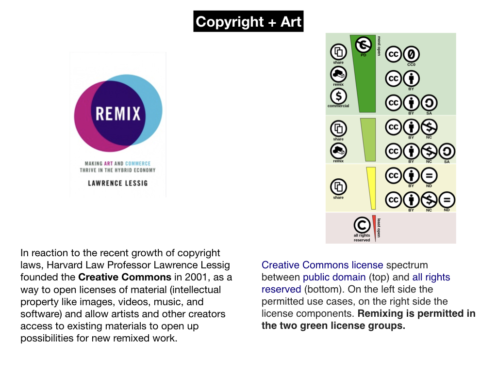
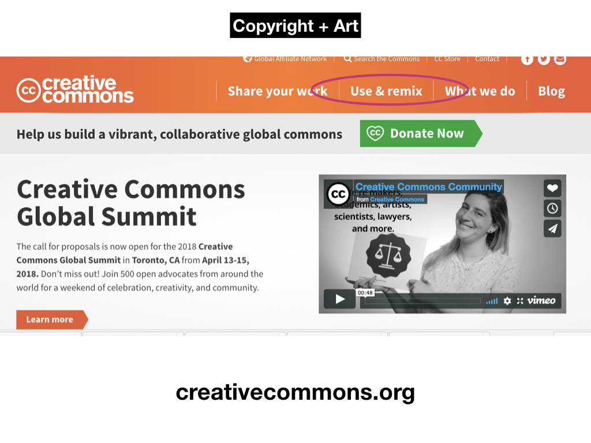
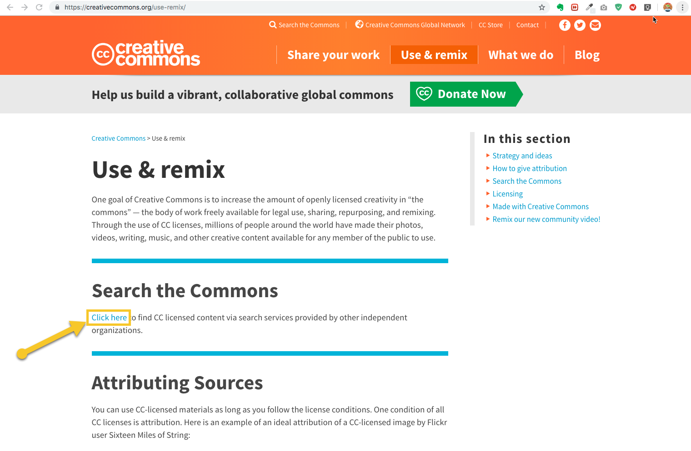
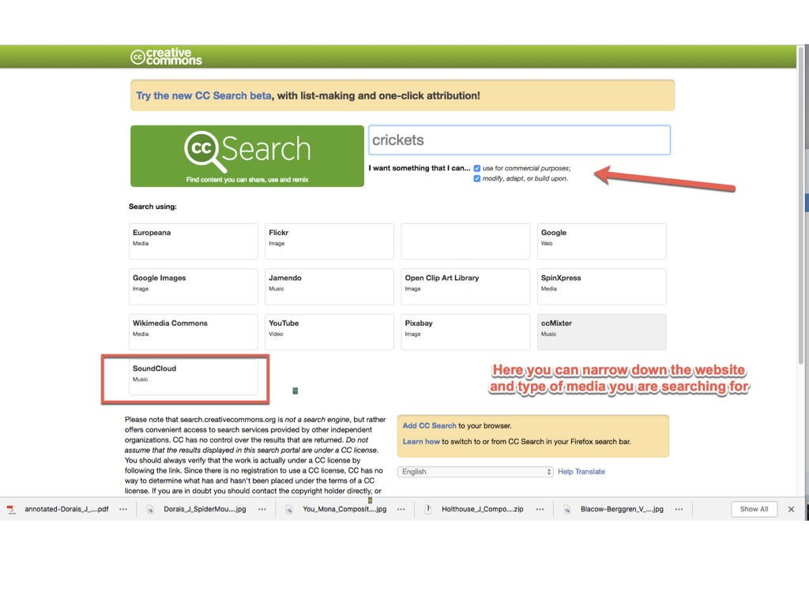

# CREATIVE COMMONS 📚 🔗 📼

#### .・゜:✧･ﾟ: *✧･ﾟ:* SJSU Art 75 | Spring 2018 *:･ﾟ✧*:･ﾟ✧

#### ***[home](..) - - - [lectures](../lectures) - - - [readings](../readings) - - - [tutorials](../tutorials)***
 ◇─◇──◇────◇────◇────◇────◇────◇─◇─◇

<!--  -->

  

### Sourcing Material online

**Sourcing Material online through Creative Commons website**

## ▼△▼△▼ Downloading video and audio from the web ([from the Resources page](https://github.com/art75/SJSU-art75/tree/master/resources#-downloading-video-and-audio-from-the-web))

##### Usage rights

* [Creative Commons](http://creativecommons.org/)
  * Use it as search term or filter for google search (image/audio only), [filter for YouTube](http://www.smartcopying.edu.au/open-education/creative-commons/creative-commons-information-pack-for-teachers-and-students/how-to-find-creative-commons-material-using-youtube), Soundcloud, etc
*  [Public Domain](https://en.wikipedia.org/wiki/Public_domain)
  * [Pond5 Public Domain Project](https://www.pond5.com/free)
  * [Internet Archive](https://archive.org/about/)
    * Their [Prelinger Public Domain Archive](https://archive.org/details/prelinger) is all usable content
  * Media from [NASA](https://www.nasa.gov/) and other gov't agencies is all in the public domain
* Fair use
  * pdf on [Best Practices in Fair Use](online_best_practices_in_fair_use.pdf)
  * Center for Media and Social Impact's [Code of Best Practies in Fair Use for Online Video](http://cmsimpact.org/code/code-best-practices-fair-use-online-video/)

##### Downloading Video from YouTube

* FIRST do a search, then select "filter results"
* Copy the YouTube video's URL into a web service like:
  * [y2Mate](https://y2mate.com/)
  * [Online Video Converter](https://www.onlinevideoconverter.com/video-converter)
  * --> Make sure you set the file format to be mp4 video
  * --> Select resolution under "more settings", you want highest resolution possible

##### Downlading Audio & Sound FX

* Soundcloud: (see above) Filter for content in Creative Commons, download through 'more' menu.
  - If starting from Soundcloud site (not Creative Commons. First do a search then select "tracks" to see the filter resuts > copyright settings)
* Websites:
  * [Free Music Archive](http://freemusicarchive.org/)
    - [field recordings](http://freemusicarchive.org/genre/Field_Recordings/)
  * [Free Sound](https://freesound.org/)
  * [Free SFX](http://www.freesfx.co.uk/)
  * [Sample Swap](http://sampleswap.org/)
  * [Sound Bible](http://soundbible.com/free-sound-effects-1.html)
  * [Free Sound Effects](http://99sounds.org/free-sound-effects/)
