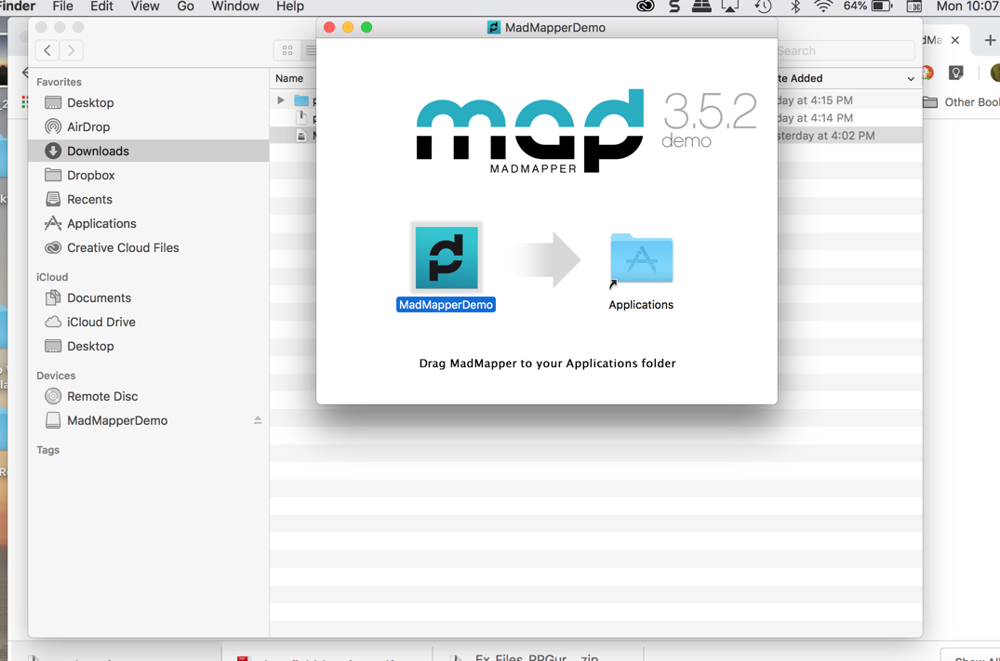
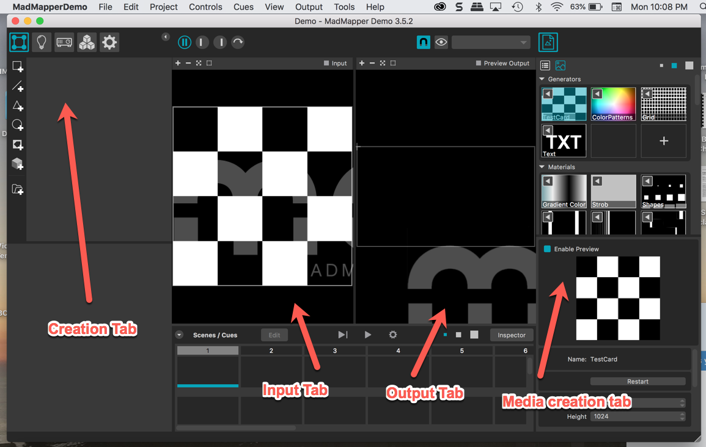
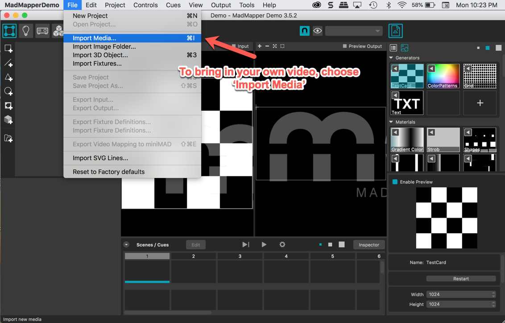
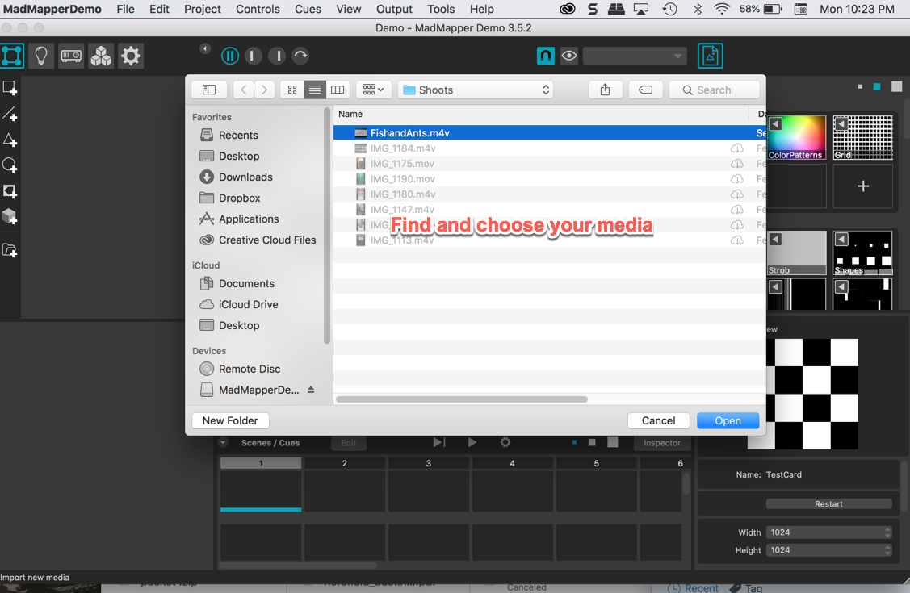
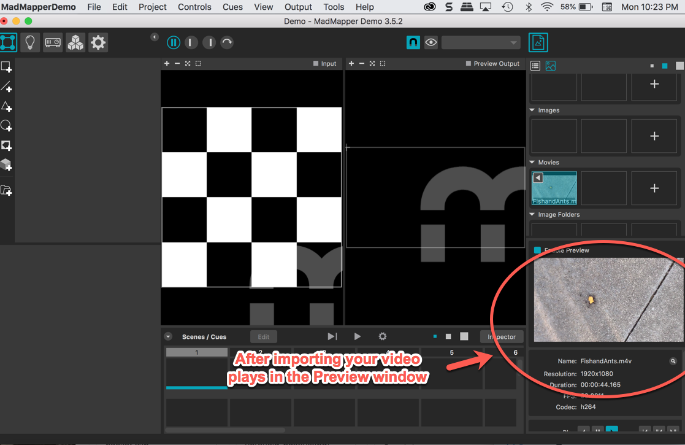
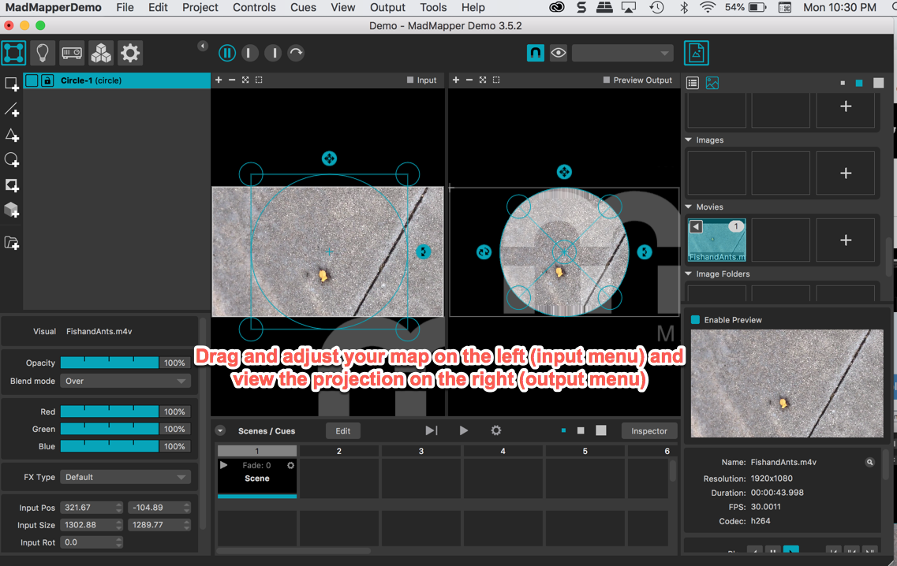
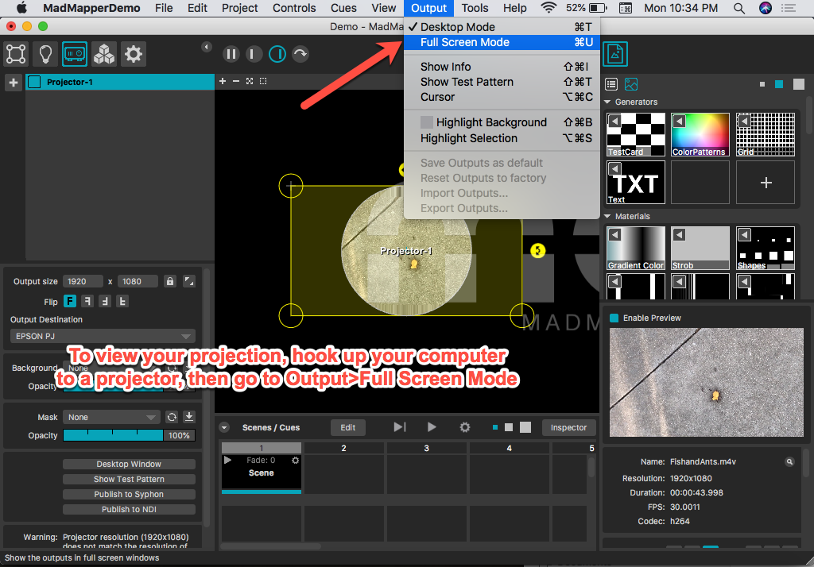
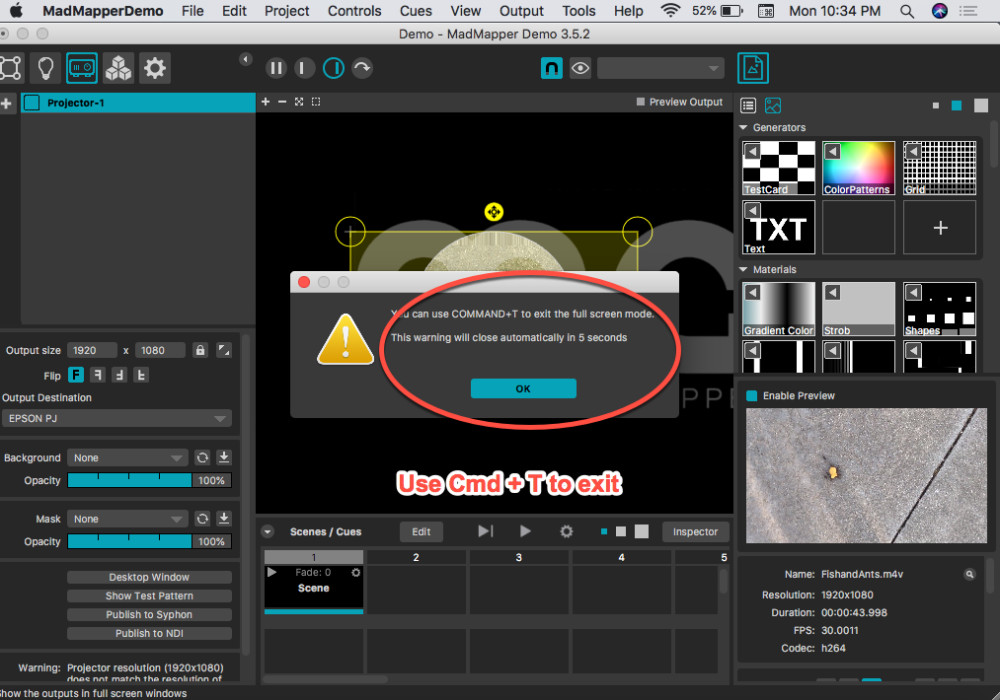

# Mad Mapper & Projection Mapping 🎥📹💻
-->[Download Mad Mapper demo version here](https://madmapper.com/)
 
-->[Mad Mapper online tutorials here](https://madmapper.com/tutorials)
 
-->[Free & Open Source projection mapping program Touch Designer](https://www.derivative.ca/)
--> [Download Step-by-step slides for using VPT in this Zip folder](VPT8_TutorialSlides.zip)

 ◇─◇──◇────◇────◇────◇────◇────◇─◇─◇
 

**Introduction to Projection Mapping**
 
 
Projection mapping is a technique that involves video projection onto objects, rooms, buildings, or other spaces or surfaces. In specialized software for projection mapping, a two- or three-dimensional object is usually spatially mapped on the virtual program which mimics the real environment it is to be projected on. The software can interact with a projector to fit any desired image onto the surface of that object. There is a great deal of potential with this technique to explore environmental experiences with video, or sculptural objects with video overlays.

Mad Mapper is a great projection mapping program that allows you to import your video, drag your projection map, and export your new file. It is not free, however, so we will use the demo version for class purposes. If you would like to continue to explore projection mapping, you are welcome to acquire your own Mad Mapper version, or you can try [Touch Designer](https://www.derivative.ca/)- another projection mapping program that is free but has a larger learning curve.

**Using Mad Mapper**

* Download and install the demo version

* There are some limits on the demo version, and a watermark on the projection.

* The workspace is very straightforward. You can view your project map and output image at the same time.  

* Try importing your own video to experiment with mapping video onto a shape or surface.

*  Your video will play in the Preview monitor.

* On the left, you can begin with a designated shape on the menu and then adjust from there.

* Drag the edges of your shape to adjust the map.

* When you're ready test your projection using the Output menu.

* Note how to exit the projection.

* Check out your projection. Adjust the position of the projector as needed to overlay your image where you want it to be.

* You can also use mad mapper to experiment with graphics and play with their properties.

--> **From here, experiment with the different options in the Creation tab. When you get stuck or want to know more, use the [Mad Mapper online tutorials here](https://madmapper.com/tutorials).**
